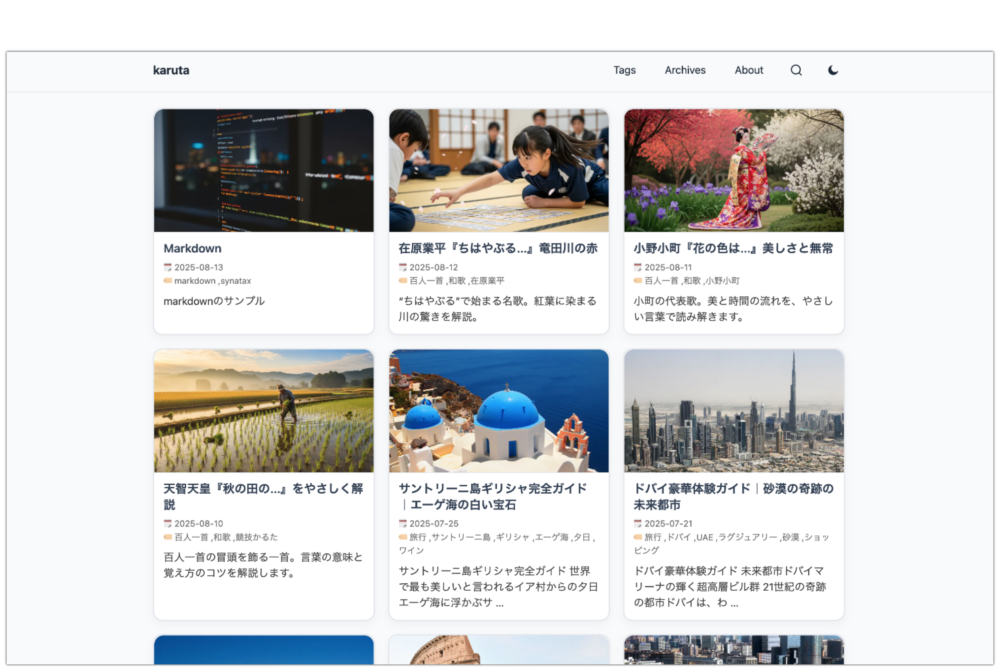

# Karuta

A clean, Japanese-friendly Hugo theme featuring a card-style layout with client-side search, dark/light mode toggle, and responsive design.

The theme name "karuta" is inspired by the Japanese card game and the drama "Chihayafuru Meguri".



## Features

- **Card-style layout** - Clean and modern card design for blog posts
- **Client-side search** - Fast search functionality without server requests
- **Dark/Light mode toggle** - User-controlled theme switching
- **Responsive design** - Mobile-friendly layout
- **Japanese typography optimized** - Excellent readability for Japanese content
- **Tags and archives** - Organized content browsing
- **Syntax highlighting** - Code syntax highlighting with Chroma
- **Mermaid diagrams** - Built-in support for Mermaid diagrams
- **Image optimization** - Automatic image processing and lazy loading
- **Lightweight implementation** - Minimal dependencies with plain HTML/CSS/JS

## Requirements

- Hugo Extended v0.115+ (uses image processing features)

## Installation

### As a Hugo Module　(Recommended)

For Hugo v0.110.0 and later, you can use Go modules to manage the theme.

Initialize your site as a Hugo module:

```bash
hugo mod init github.com/yourusername/yoursite
hugo mod get github.com/yamadatt/hugo-theme-karuta
```
Add the following to your `hugo.toml` (or `config.toml`):

```toml
[module]
  [[module.imports]]
    path = "github.com/yamadatt/hugo-theme-karuta"
```

### As a Git Submodule 

```bash
git submodule add https://github.com/yamadatt/hugo-theme-karuta themes/karuta
```

Then specify the theme in your `config.toml`:

```toml
theme = "karuta"
```

### Configuration

Add these settings to your `config.toml`:

```toml
baseURL = "https://example.com/"
theme   = "karuta"

[params]
  description      = "Your site description"
  hideTitleIcon    = true                    # Hide the round icon next to title
  defaultCover     = "/img/default-cover.svg" # Default thumbnail image
  popularTagsCount = 8                       # Number of popular tags to display

[markup.highlight]
  noClasses = false
  style     = "xcode"

[outputs]
  home    = ["HTML", "JSON"]
  section = ["HTML", "JSON"]
```


## Customization

### Logo and Icons

- Place your logo/icon at `static/favicon.svg`
- Default cover image at `static/img/default-cover.svg`

### Color Scheme

The theme supports both light and dark modes. Users can toggle between them using the theme switcher in the header.

### Search Configuration

The search functionality works automatically with all published posts. No additional configuration required.

## Development

To run the theme locally for development:

```bash
hugo server -D
```

## License

This theme is released under the [MIT License](LICENSE).

## Credits

- Inspired by the Japanese card game "karuta" and the drama "Chihayafuru Meguri"
- Built with modern web standards and accessibility in mind
- Optimized for Japanese typography and reading experience
