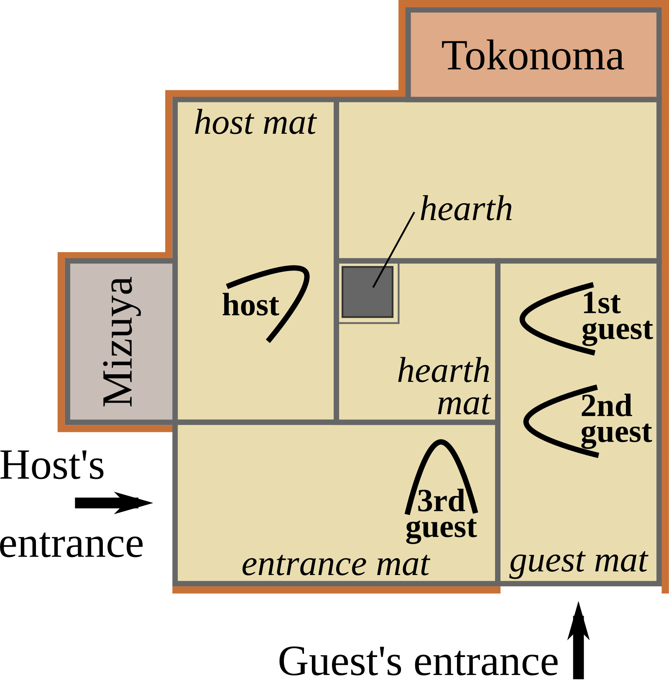
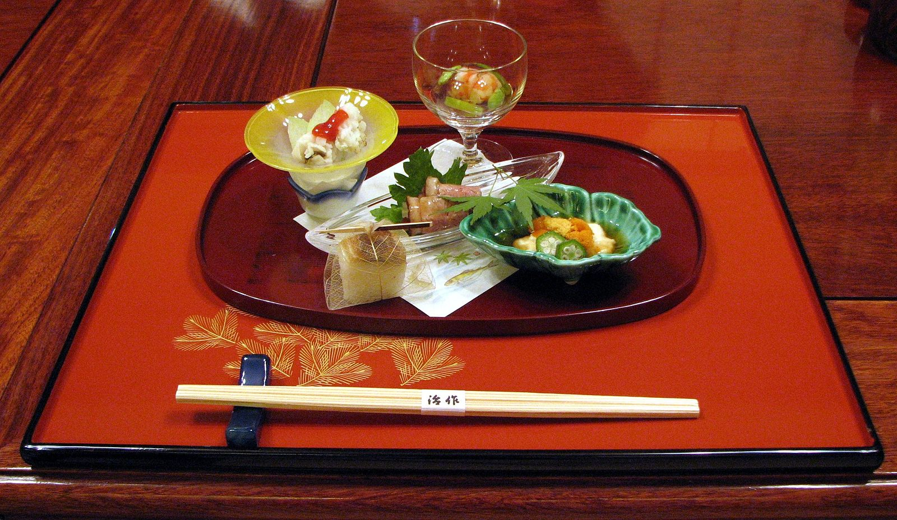

# 日本料理懐石ガイド

*季節の移ろいを表現した美しい前菜の数々*

懐石料理は、茶道の心得から生まれた日本料理の最高峰です。「一期一会」の精神のもと、その日、その季節にしか味わえない食材を使い、料理人の技と心を込めて創り上げられる芸術作品。四季の美しさを五感で感じ、日本の自然と文化の深さを味わう、まさに「もてなしの極み」と言える料理体系です。

## 🍃 懐石料理の精神

### 茶道との深い関係

*茶室で供される本格的な懐石料理*

懐石料理は元々、茶道の茶事において濃茶をいただく前に供される軽い食事でした。

**懐石の心得**
- **一汁三菜**: 汁物1品、おかず3品の基本構成
- **質素倹約**: 華美を避け、素材の持つ美しさを活かす
- **季節感**: 旬の食材で季節の移ろいを表現
- **おもてなし**: 客人への心からの配慮

### 「もてなし」の美学

**懐石の根本精神**
- **亭主と客**: 互いを思いやる関係性
- **その場限り**: 二度と同じ組み合わせはない特別な時間
- **自然との調和**: 季節や気候に合わせた料理構成
- **簡素の美**: 無駄を省いた洗練された美しさ

## 🌸 季節ごとの懐石料理

### 春の懐石｜新緑の息づかい

*桜や若葉をモチーフにした春の懐石料理*

**春の代表的食材**
- **山菜**: たけのこ、わらび、ぜんまい、ふきのとう
- **魚介**: 桜鯛、桜海老、白魚、はまぐり
- **野菜**: 菜の花、たらの芽、うど、木の芽
- **花材**: 桜、菜の花、すみれ、山吹

**春の懐石構成例**
1. **先付**: 桜海老と菜の花の白和え
2. **椀物**: 桜鯛の真薯とたけのこの吸い物
3. **向付**: 白魚の踊り食い
4. **煮物椀**: 若竹煮（たけのこと若布）
5. **焼物**: 鮎の若草焼き
6. **ご飯・味噌汁・香の物**

### 夏の懐石｜涼を演出する技

*ガラスの器で涼しさを演出した夏の懐石*

**夏の涼味**
- **器選び**: ガラスや青磁で視覚的に涼しく
- **調理法**: 冷製料理や酢の物で さっぱりと
- **色彩**: 青や白を基調とした清涼感
- **香り**: 柚子や生姜で爽やかなアクセント

**夏の代表メニュー**
- **冷製茶碗蒸し**: 枝豆と海老の冷たい茶碗蒸し
- **鮎の塩焼き**: 清流の香りを楽しむ
- **冬瓜の薄葛煮**: 透明感のある上品な煮物
- **水菓子**: 葛切りや水羊羹で締めくくり

### 秋の懐石｜実りの豊かさ

*紅葉のような美しい色合いの秋の懐石*

**秋の味覚**
- **きのこ類**: 松茸、しめじ、なめこ、舞茸
- **根菜**: さつまいも、里芋、人参、大根
- **魚**: さんま、さば、鮭、はたはた
- **木の実**: 銀杏、栗、柿、梨

**秋の懐石の特徴**
- **色彩豊か**: 紅葉を思わせる赤や黄色の取り合わせ
- **食材の旨味**: 脂の乗った魚や甘みの増した野菜
- **器の選択**: 備前焼や織部焼など土の温かみのある器
- **季節感**: もみじや柿の葉などの季節の演出

### 冬の懐石｜温もりのおもてなし

*湯気が立ち上る温かな冬の懐石料理*

**冬の温味**
- **鍋物**: 体を温める汁気の多い料理
- **根菜**: 甘みとコクのある冬野菜
- **魚**: 寒ぶり、金目鯛、河豚、牡蠣
- **調理法**: 煮物や蒸し物で温かく

**冬の懐石メニュー例**
- **蒸し物**: 茶碗蒸しや蟹真薯
- **煮物**: ぶり大根や鴨鍋
- **焼物**: 西京焼きや柚庵焼き
- **締めくくり**: 温かいご飯と味噌汁

## 🥢 懐石料理の流れ

### 基本の構成「一汁三菜」

*伝統的な一汁三菜の構成*

**正式な懐石の順序**
1. **先付（さきづけ）**: 季節感のある小さな前菜
2. **椀物（わんもの）**: 澄まし汁
3. **向付（むこうづけ）**: お造り
4. **煮物椀（にものわん）**: 季節の煮物
5. **焼物（やきもの）**: 魚の焼き物
6. **強肴（しいざかな）**: 追加の酒の肴
7. **ご飯・止め椀・香の物**: 食事の締めくくり
8. **水菓子（みずがし）**: 季節の果物や和菓子

### 器と盛り付けの美学

*料理を引き立てる美しい懐石の器*

**器選びの原則**
- **季節感**: 春は桜柄、夏は青磁、秋は織部、冬は備前
- **料理との調和**: 食材の色や形に合わせた器選び
- **格式**: 客人への敬意を表す上質な器
- **実用性**: 食べやすさも考慮した機能美

**盛り付けの技法**
- **自然の美**: 自然の中での食材の姿を再現
- **余白の美**: 器の空間も料理の一部
- **季節の演出**: 葉や花で季節感をプラス
- **視覚的バランス**: 色彩と形の調和

## 🎋 懐石料理店の選び方

### 格式による分類

*伝統的な高級懐石料理店の落ち着いた雰囲気*

**料亭クラス**
- **老舗料亭**: 数百年の歴史を持つ格式高い店
- **個室対応**: 落ち着いてゆっくりと楽しめる
- **価格帯**: 1人3-15万円
- **予約**: 数ヶ月前からの予約が必要

**懐石料理専門店**
- **茶道との関係**: 本格的な茶懐石を提供
- **季節感重視**: 旬の食材と季節の演出
- **価格帯**: 1人2-8万円
- **体験型**: 懐石の心と技を学べる

### 有名懐石料理店

**京都の名店**
- **菊乃井**: 3つ星の老舗料亭
- **瓢亭**: 400年の歴史を持つ朝粥で有名
- **萬福寺**: 精進懐石の名店
- **和久傳**: 海の幸を活かした懐石

**東京の名店**
- **神田川**: 懐石料理の神様の店
- **つきじ植むら**: 築地の老舗料亭
- **青柳**: 現代的な感性の懐石
- **小松**: 繊細な技が光る名店

## 🍶 懐石と日本酒の組み合わせ

### 季節の日本酒ペアリング

*料理に合わせて選ばれた日本酒との完璧なペアリング*

**春の酒**
- **花見酒**: 桜を愛でながら飲む薄桜色の酒
- **山廃仕込み**: 深みのある味わいで山菜料理に
- **純米吟醸**: フルーティーな香りで春野菜に

**夏の酒**
- **冷酒**: キリッと冷やした爽やかな味わい
- **夏の生酒**: フレッシュな香りと軽やかさ
- **スパークリング**: 泡で涼しさを演出

**秋の酒**
- **ひやおろし**: 秋の食材と相性抜群の熟成酒
- **純米**: 米の旨味がきのこ料理を引き立てる
- **燗酒**: 温めることで香りと味に深みが

**冬の酒**
- **新酒**: フレッシュな味わいで鍋料理に
- **古酒**: 熟成された複雑味で冬の味覚に
- **濁り酒**: 温かみのある味わい

## 🏡 家庭での懐石料理

### 簡単懐石の作り方

*家庭でも楽しめる簡単な懐石料理*

**家庭懐石のポイント**
- **一汁一菜**: まずは基本から始める
- **季節の食材**: スーパーで買える旬の食材を活用
- **器の工夫**: 手持ちの器でも季節感を演出
- **心を込める**: 家族への思いやりが一番大切

**初心者向けメニュー**
1. **先付**: 胡麻豆腐の木の芽添え
2. **椀物**: たけのこと鯛の吸い物
3. **向付**: 白身魚のお造り
4. **炊合せ**: 季節野菜の煮物
5. **ご飯**: 土鍋で炊いた白ご飯

### 懐石の心を学ぶ

**家庭で実践する懐石の精神**
- **季節を感じる**: 旬の食材で季節感を表現
- **器を大切に**: 料理に合った器選び
- **丁寧な準備**: 心を込めた下ごしらえ
- **感謝の気持ち**: 食材と作り手への感謝

## 🎓 懐石料理を学ぶ

### 料理教室と体験

*プロから学ぶ懐石料理教室*

**学習方法**
- **料理教室**: 基礎から学べる専門教室
- **茶道**: 懐石の心得を茶道から学ぶ
- **料理本**: 季節ごとの懐石レシピ集
- **料亭体験**: 本物の懐石を味わい学ぶ

**習得すべき技術**
- **包丁技術**: 美しい切り口と均一な切り方
- **出汁取り**: 昆布と鰹節の基本出汁
- **季節感**: 旬の食材の見極めと扱い方
- **盛り付け**: 器と料理の美しい調和

## 💎 懐石料理の現代的進化

### モダン懐石の世界

*伝統的な技法に現代的な感性を加えたモダン懐石*

**現代懐石の特徴**
- **国際的食材**: 世界の食材を日本料理の技法で
- **新しい器**: モダンなデザインの器との融合
- **革新的技法**: 科学的手法を取り入れた調理
- **若い感性**: 次世代料理人による新しい表現

**注目の料理人**
- **村田吉弘**: 伝統と革新を融合させる巨匠
- **高橋拓児**: 京都の名店「木乃婦」三代目
- **前田元**: 東京「元」の革新的懐石
- **飯田知史**: 大阪「湖月」の繊細な技

## まとめ

懐石料理は、日本人の自然観、美意識、おもてなしの心が結晶化した、世界に誇る食文化の最高峰です。季節の移ろいを五感で感じ、料理人の技と心に触れ、日本の美の本質を味わう──それが懐石料理の醍醐味です。

*心を込めて仕上げられた懐石料理の美しい最終演出*

一期一会の精神のもと、その瞬間にしか味わえない特別な時間を演出する懐石料理。伝統を受け継ぎながらも、現代に生きる私たちの感性と調和し、常に進化し続ける生きた芸術です。季節の恵みに感謝し、美しいものを美しいと感じる心を大切に、懐石料理の奥深い世界をぜひお楽しみください。