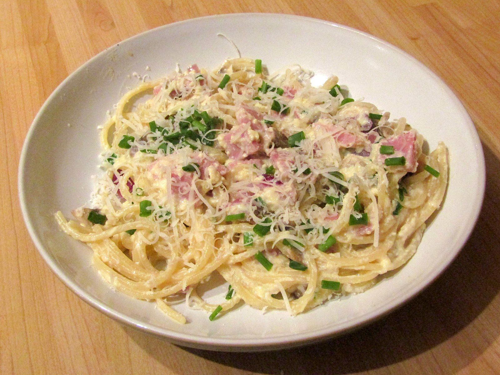
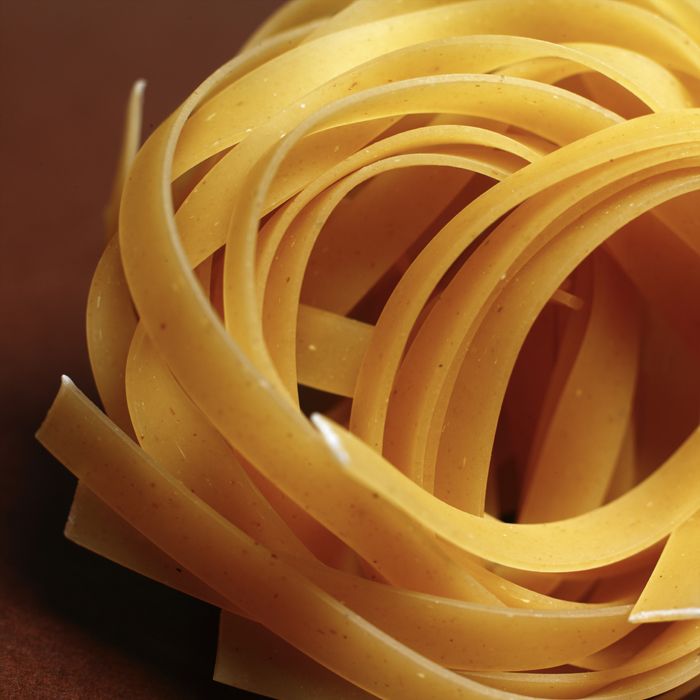

# イタリアパスタ完全ガイド

*熟練した職人の手によって作られる美しいパスタ*

パスタは単なる食べ物ではなく、イタリア人の魂と歴史が詰まった文化そのものです。北イタリアの卵麺から南イタリアの硬質小麦パスタまで、各地域の気候、歴史、文化が生み出した多様なパスタの世界。マンマ（お母さん）から娘へと代々受け継がれる伝統的な技法と、地元の食材を活かした郷土料理の数々を、本場の知識と共にご紹介します。

## 🍝 パスタの歴史と文化

### パスタのルーツ

*古代ローマ時代から続くパスタ作りの伝統*

**パスタの起源**
- **古代起源**: 紀元前1世紀の古代ローマ時代から存在
- **中世発達**: 11-12世紀にかけて現在の形に近いものが登場
- **大航海時代**: トマトの伝来で現代的なパスタ料理が誕生
- **産業革命**: 19世紀の機械化で大量生産が可能に

### 地域による違い

**北イタリア**
- **卵パスタ**: タリアテッレ、フェットゥチーネ
- **リゾット**: 米料理も盛んな地域
- **リッチな味付け**: バター、クリーム、チーズ
- **肉料理**: 牛肉やジビエを使った重厚なソース

**中央イタリア**
- **手打ちパスタ**: ピチ、ウンブリケッリ
- **シンプル**: オリーブオイルとガーリックベース
- **豚肉**: グアンチャーレ（豚頬肉）の活用
- **トマト**: 適度な酸味のトマトソース

**南イタリア**
- **硬質小麦**: デュラム小麦100%の乾燥パスタ
- **魚介類**: 豊富な海の恵みを活用
- **オリーブオイル**: 良質なエクストラバージンオイル
- **野菜**: トマト、ナス、ズッキーニなど

## 🌾 パスタの種類と特徴

### ロングパスタ（長いパスタ）

*太さや形状の異なる多様なロングパスタ*

**スパゲッティ（直径1.8-2.0mm）**
- **基本のパスタ**: 最もスタンダードな細長いパスタ
- **適合ソース**: トマト、オイル、クリーム系
- **代表料理**: ペペロンチーノ、ボロネーゼ、カルボナーラ

**フェットゥチーネ（幅8-10mm）**
- **平打ち麺**: 卵を使った北イタリアの代表的パスタ
- **特徴**: 幅広でソースの絡みが良い
- **適合ソース**: クリーム、バター、ミートソース
- **代表料理**: アルフレード、ボロネーゼ

**リングイネ（楕円形断面）**
- **形状**: スパゲッティを平たくした楕円形
- **特徴**: 魚介類のソースによく合う
- **代表料理**: ボンゴレ、海老のアラビアータ

**エンジェルヘア（カペッリーニ）**
- **極細**: 直径0.9-1.3mmの最も細いパスタ
- **調理**: 短時間で茹で上がる繊細なパスタ
- **適用**: 冷製パスタやスープパスタに

### ショートパスタ（短いパスタ）

*形状豊かなショートパスタの数々*

**ペンネ（ペン先型）**
- **筒状**: 斜めにカットされた筒型パスタ
- **リガーテ**: 溝があるタイプでソースが絡みやすい
- **代表料理**: アラビアータ、プッタネスカ

**フジッリ（螺旋型）**
- **らせん状**: ねじれた形状でソースをキャッチ
- **用途**: サラダや具材たっぷりの料理に
- **特徴**: 冷製でも温製でも美味しい

**リガトーニ（大きな筒型）**
- **太い筒**: ペンネより太く長い筒状
- **溝**: 外側の溝でソースを保持
- **適合**: 濃厚なソースや肉料理に

**ファルファッレ（蝶々型）**
- **可愛い形**: 蝶々や蝶ネクタイのような形状
- **食感**: 中央が厚く端が薄い独特の食感
- **用途**: クリームソースやサラダに

### 詰め物パスタ

*職人による手作りラビオリの製作風景*

**ラビオリ（四角い詰め物）**
- **正方形**: 四角い形状の代表的詰め物パスタ
- **中身**: リコッタチーズ、ほうれん草、肉など
- **ソース**: バターソース、トマトソース、クリーム系

**トルテッリーニ（リング状）**
- **エミリア・ロマーニャ州**: ボローニャ地方の特産
- **形状**: 小さなリング状に成形
- **伝統**: 手作業で一つずつ丁寧に成形
- **中身**: 肉、チーズ、野菜のミックス

**アニョロッティ（三日月型）**
- **ピエモンテ州**: 北イタリアの伝統的パスタ
- **特徴**: 小さな三日月型で上品な見た目
- **詰め物**: 肉、野菜、チーズの組み合わせ

## 🍅 地域別代表的パスタ料理

### 南イタリア・ナポリの味

*太陽の恵みをたっぷり受けたナポリのパスタ料理*

**スパゲッティ・ポモドーロ**
- **基本中の基本**: トマトソースのシンプルパスタ
- **材料**: 完熟トマト、ガーリック、バジル、オリーブオイル
- **ポイント**: トマトの甘みと酸味のバランス
- **仕上げ**: フレッシュバジルとパルミジャーノチーズ

**スパゲッティ・アッレ・ボンゴレ（アサリのパスタ）**
- **海の幸**: 新鮮なアサリの旨味を活かす
- **白ワイン**: アサリの臭みを取り旨味を引き出す
- **ガーリック**: オリーブオイルで香りを移す
- **パセリ**: 最後に散らして色と香りをプラス

**プッタネスカ（娼婦風）**
- **力強い味**: アンチョビ、オリーブ、ケッパーの塩味
- **トマトベース**: 酸味と塩味の絶妙なバランス
- **唐辛子**: ピリッとしたアクセント
- **由来**: 短時間で作れる忙しい女性のための料理

### ローマの伝統料理

*本場ローマのクリーミーなカルボナーラ*

**カルボナーラ**
- **材料**: 卵、ペコリーノチーズ、グアンチャーレ、黒胡椒
- **技術**: 卵を固まらせずにクリーミーに仕上げる技法
- **重要**: 生クリームは使わないのが本場流
- **コツ**: パスタの余熱で卵とチーズを乳化させる

**アマトリチャーナ**
- **アマトリーチェ発祥**: 羊飼いの町の伝統料理
- **材料**: グアンチャーレ、トマト、ペコリーノ、唐辛子
- **特徴**: シンプルながら奥深い味わい
- **パスタ**: 本来はブカティーニという太いパスタで

**カチョ・エ・ペペ**
- **究極のシンプル**: チーズと胡椒だけの料理
- **材料**: ペコリーノチーズ、黒胡椒、パスタの茹で汁
- **技術**: パスタの茹で汁でチーズを乳化させる
- **修行**: 料理人の技術が問われる奥深い一品

### 北イタリア・エミリア・ロマーニャ州

*ボローニャ伝統の手作りタリアテッレ*

**タリアテッレ・アル・ラグー（ボロネーゼ）**
- **肉のソース**: 牛ひき肉をじっくり煮込んだリッチなソース
- **白ワイン**: 肉の臭みを取り深みを加える
- **野菜**: 人参、セロリ、玉ねぎのソフリット
- **仕上げ**: パルミジャーノチーズをたっぷりと

**ラザニア・ボロネーゼ**
- **層重ね**: パスタ生地、ミートソース、ベシャメルソース
- **手作り生地**: 卵入りの薄いパスタシート
- **オーブン料理**: じっくり焼き上げる家庭料理の王様
- **伝統**: 日曜日の家族のご馳走

## 👩‍🍳 本格パスタの作り方

### 手打ちパスタ生地の基本

*小麦粉と卵から作る手打ちパスタ生地*

**基本材料（4人分）**
- **セモリナ粉**: 300g（または強力粉200g+セモリナ粉100g）
- **卵**: 全卵3個
- **オリーブオイル**: 大さじ1
- **塩**: 小さじ1/2

**作り方の手順**
1. **粉の土手**: 粉をドーナツ状に並べ中央に卵を割り入れ
2. **混合**: フォークで卵を溶きながら少しずつ粉と混ぜる
3. **捏ね**: 10-15分しっかりと捏ね、滑らかな生地にする
4. **休ませ**: ラップで包み30分以上休ませる
5. **延ばし**: パスタマシンで薄く延ばし、お好みの形にカット

### アルデンテの茹で方

*大きな鍋でたっぷりのお湯で茹でるパスタ*

**茹で方のコツ**
1. **大量の湯**: パスタ100gに対して水1リットル
2. **塩分**: 湯量の1%の塩（海水程度の塩分）
3. **投入**: 沸騰したらパスタを一気に入れる
4. **時間管理**: 表示時間より1-2分短く茹でる
5. **仕上げ**: ソースと一緒に1-2分煮絡める

**アルデンテのポイント**
- **中心の芯**: 針の先ほどの芯が残る状態
- **食感**: 歯ごたえがあり弾力がある
- **温度**: 熱々の状態で提供
- **ソースとの一体感**: パスタとソースが完全に絡む

## 🍷 パスタとワインのペアリング

### 地域別ワインとの組み合わせ

*パスタ料理と相性抜群のイタリアワインの組み合わせ*

**トマトベース料理**
- **キャンティ・クラシコ**: トスカーナの赤ワイン
- **モンテプルチアーノ**: アブルッツォの力強い赤
- **サンジョヴェーゼ**: イタリア全土で作られる万能品種

**クリーム・チーズ系**
- **ソアーヴェ**: ヴェネト州の爽やかな白ワイン
- **フリウラーノ**: フリウリの香り高い白
- **シャルドネ**: 樽熟成のコクのある白

**魚介系**
- **ヴェルメンティーノ**: リグーリア海岸の白ワイン
- **プロセッコ**: ヴェネト州のスパークリング
- **ファランギーナ**: カンパニア州のミネラル豊かな白

## 🏪 イタリア食材の選び方

### パスタの選び方

*品質の良いイタリア産パスタの見分け方*

**品質の見分け方**
- **デュラム小麦100%**: 原材料表示の確認
- **ブロンズダイス**: 表面がザラザラしているもの
- **低温乾燥**: じっくり時間をかけて乾燥させたもの
- **イタリア産**: IGP（地理的表示保護）マーク

**おすすめブランド**
- **ディ・チェコ**: 130年の歴史を持つ老舗ブランド
- **バリラ**: イタリア最大手の安定した品質
- **ルマケ**: アブルッツォ州の高級パスタ
- **セタロ**: 伝統製法にこだわるプレミアムブランド

### 本格的な材料選び

**パルミジャーノ・レッジャーノ**
- **24ヶ月熟成**: 最低限の熟成期間
- **36ヶ月熟成**: より深いコクと旨味
- **DOP認証**: 本場の品質保証マーク
- **保存方法**: 冷蔵庫で適切に保管

**エクストラバージンオリーブオイル**
- **コールドプレス**: 低温圧搾法
- **酸度**: 0.8%以下が理想
- **産地**: トスカーナ、リグーリア、プーリア州
- **新鮮さ**: 製造から1-2年以内のもの

## 🍴 家庭で作る本格イタリアン

### 初心者でも作れる簡単レシピ

*家庭で簡単に作れる本格的なパスタ料理*

**アーリオ・オーリオ・エ・ペペロンチーノ**
- **材料**: ガーリック、オリーブオイル、唐辛子、パセリ
- **コツ**: ガーリックを焦がさずゆっくり香りを出す
- **仕上げ**: パスタの茹で汁で乳化させる
- **所要時間**: 15分で完成

**マルゲリータ・パスタ**
- **材料**: フレッシュトマト、モッツァレラ、バジル
- **シンプル**: 素材の味を活かすピッツァ風パスタ
- **仕上げ**: 火を止めてからモッツァレラを加える
- **ポイント**: フレッシュバジルをたっぷりと

### マンマの味を再現するコツ

**料理のポイント**
- **愛情**: 家族への愛情を込めて作る
- **時間**: 急がずゆっくりと丁寧に
- **素材**: 良い材料を適量使う
- **伝統**: 古くから伝わるレシピを尊重

**味付けの基本**
- **塩**: パスタの茹で湯、ソースの両方で調整
- **酸味**: トマトやワインで爽やかさを
- **油分**: オリーブオイルで全体をまとめる
- **チーズ**: 最後の仕上げでコクをプラス

## まとめ

イタリアのパスタ料理は、単なる食事を超えた文化的な体験です。各地域の歴史、気候、文化が生み出した多様性豊かなパスタの世界には、イタリア人の家族への愛、故郷への誇り、そして人生を楽しむ精神が込められています。

*愛情込めて作られた美しいパスタ料理*

マンマから受け継がれる伝統的なレシピと技法を学び、良質な食材を選び、そして何より愛情を込めて作ることで、本場イタリアの味を家庭で再現することができます。*Buon appetito!*（美味しくお召し上がりください！）
