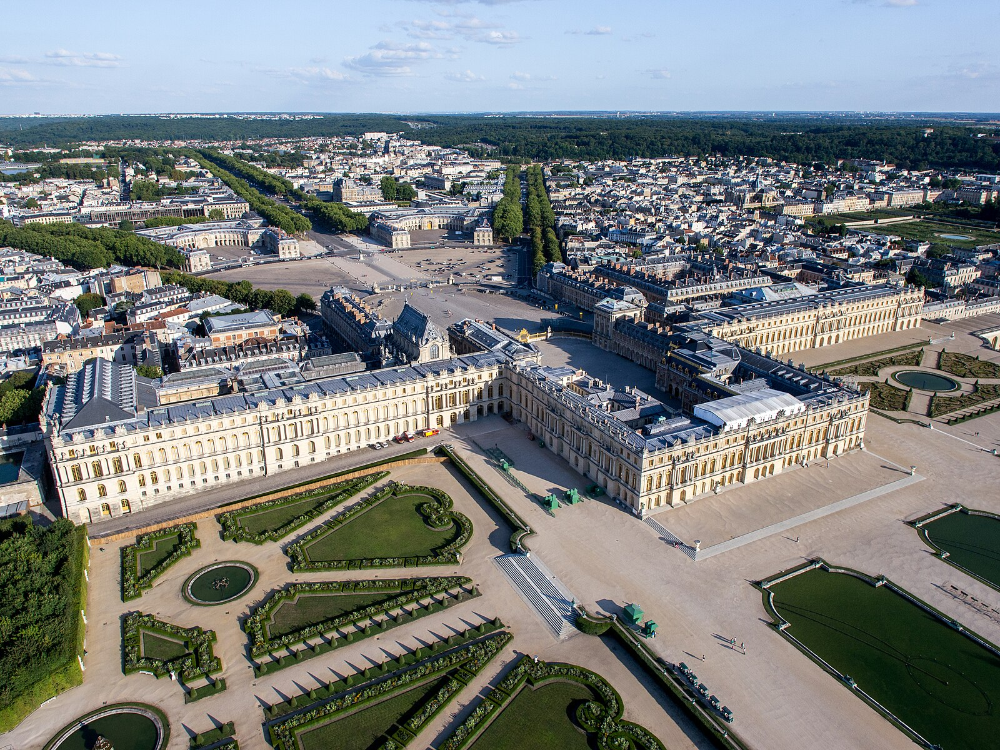
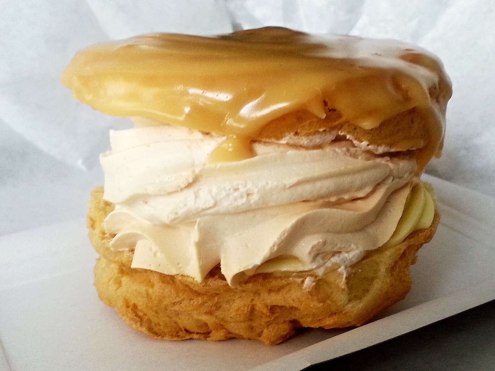
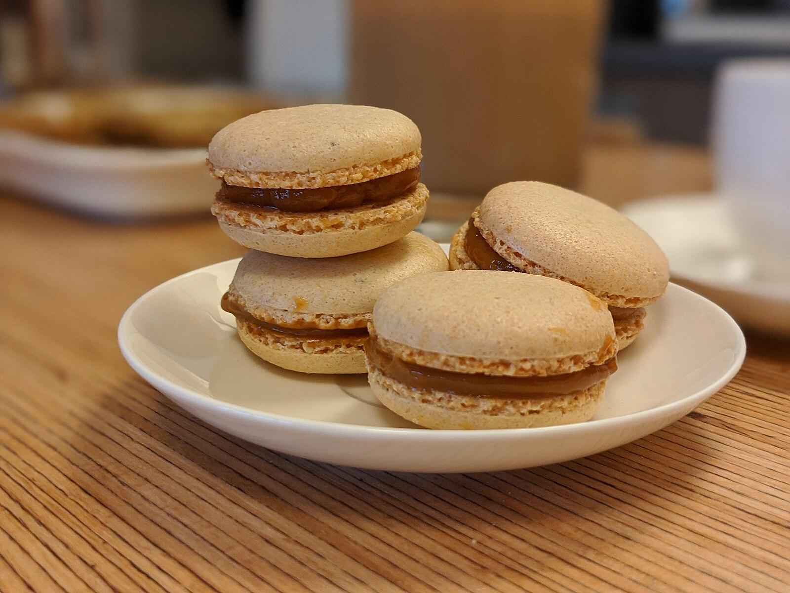
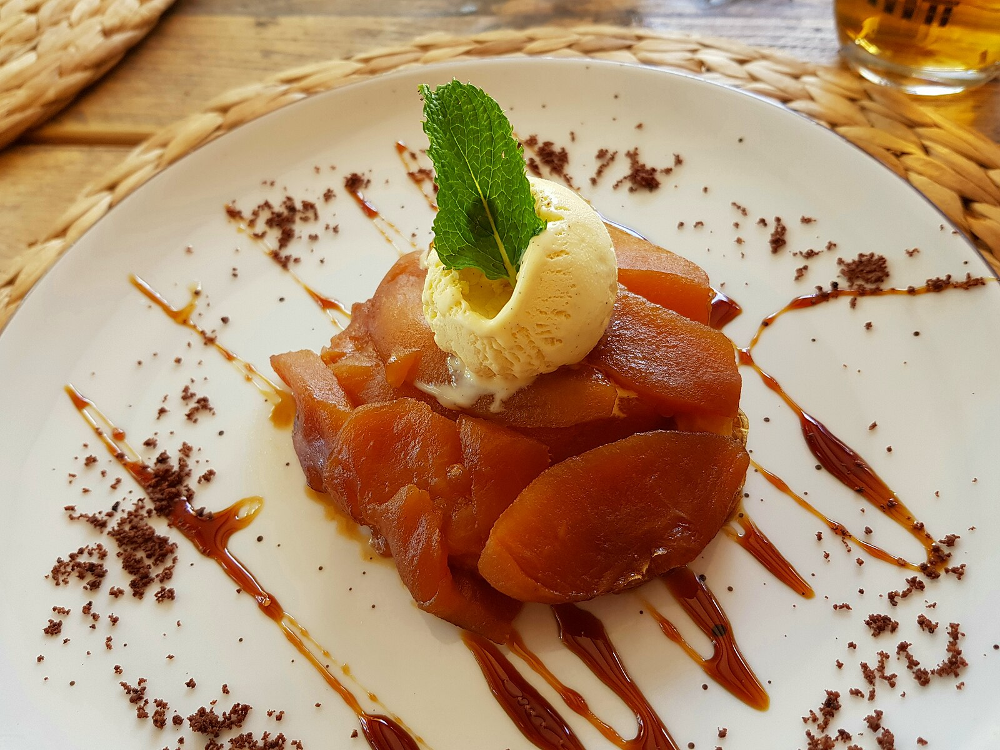
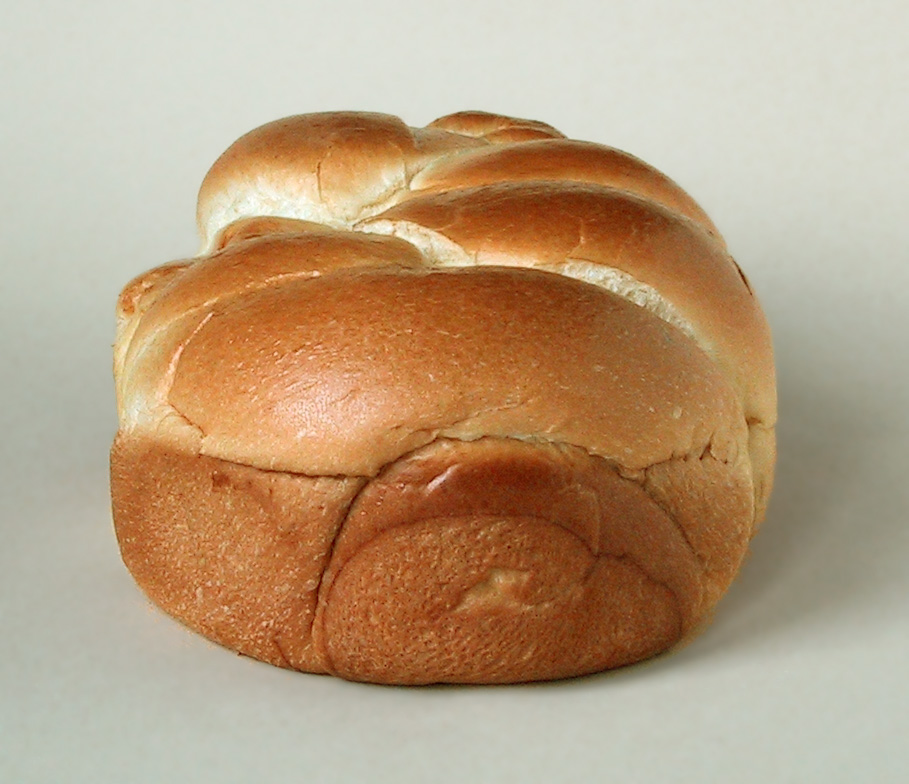
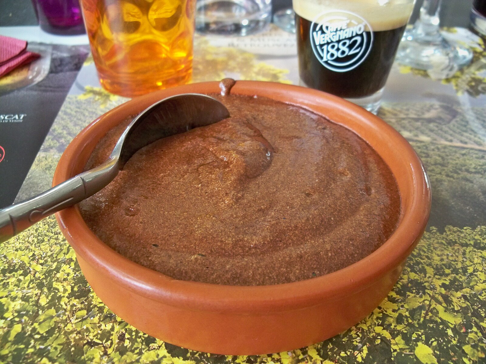

# フランス菓子職人ガイド

*熟練パティシエの繊細で美しい手作業*

フランス菓子は、芸術性と技術性を兼ね備えた世界最高峰の菓子文化です。16世紀から発達したパティスリーの伝統は、厳格な技法と創造性の絶妙なバランスの上に成り立っています。パリの老舗パティスリーから現代の革新的なシェフまで、フランス菓子の世界には美味しさだけでなく、視覚的な美しさ、香り、食感のすべてが計算し尽くされた芸術作品が存在します。

## 🎂 フランス菓子の歴史と文化

### 宮廷文化から生まれた芸術

*ヴェルサイユ宮殿で花開いた華麗な菓子文化*

**歴史的発展**
- **16世紀**: イタリアからフランスへの菓子技術伝来
- **17-18世紀**: ヴェルサイユ宮殿で洗練された宮廷菓子の発達
- **19世紀**: アントナン・カレームによる近代パティスリーの確立
- **20-21世紀**: ピエール・エルメなど革新的パティシエの登場

### フランス菓子の哲学

**美食の基本原則**
- **技術の完璧性**: 基本技法の徹底的な習得
- **素材への敬意**: 最高品質の材料の厳選
- **美的センス**: 視覚的美しさの追求
- **革新の精神**: 伝統を尊重しながらの創造性

**職人の精神**
- **メートル・パティシエ**: 職人の最高位
- **コンパニオナージュ**: 職人の修行制度
- **継承**: 師匠から弟子へ受け継がれる技と心
- **誇り**: フランス文化の担い手としての自覚

## 🥐 基本の生地と技法

### パート・フィユテ（折りパイ生地）

*バターを層状に折り込むパイ生地の技法*

**技法の原理**
- **層状構造**: 生地とバターの層を重ねる
- **温度管理**: バターの硬さを一定に保つ
- **折り込み**: 正確な折り方で均一な層を作る
- **休ませ**: 生地の弾力を調整

**代表的な菓子**
- **クロワッサン**: 朝食の定番、バターの香り豊か
- **パルミエ**: パイ生地に砂糖をまぶして焼いた菓子
- **ミルフィーユ**: パイとクリームの層が美しいケーキ
- **ガレット・デ・ロワ**: 新年の伝統菓子

### パート・シュー（シュー生地）

*シュー生地を美しく絞り出す職人技*

**作り方の基本**
1. **パナダ**: 水、バター、塩を沸騰させ小麦粉を加える
2. **デセッシュ**: 水分を飛ばしながら練り混ぜる
3. **卵の添加**: 少しずつ卵を加えて艶のある生地にする
4. **絞り**: 口金を使って形を整える

**代表的なシュー菓子**
- **エクレア**: 細長いシューにクリームとグラサージュ
- **シュークリーム**: 丸いシューにカスタードクリーム
- **サントノレ**: 小さなシューを組み合わせた華やかなケーキ
- **プロフィトロール**: 小さなシューにアイスとチョコソース

### パート・サブレ（サブレ生地）

*バターの風味豊かなサブレ生地作り*

**3つの基本配合**
- **パート・サブレ**: 基本のサブレ生地
- **パート・シュクレ**: 砂糖多めの甘いタルト生地
- **パート・ブリゼ**: 塩味のキッシュ生地

**技法のポイント**
- **サブラージュ**: バターと粉を砂状に混ぜる
- **フレゼ**: 手の平で生地をまとめる
- **休ませ**: 冷蔵庫で生地を休ませる
- **敷き込み**: タルト型に均一に敷く

## 🍰 クラシックなフランス菓子

### マカロン｜パリジェンヌの愛するお菓子

*宝石のように美しいカラフルなマカロン*

**マカロンの技術**
- **マカロナージュ**: アーモンドプードルとメレンゲを混ぜる技法
- **コック**: 表面にできる足のような部分
- **ガナッシュ**: 中に挟むクリーム
- **マトゥラシオン**: 完成後の熟成時間

**人気のフレーバー**
- **バニラ**: 最もクラシックな味
- **フランボワーズ**: 酸味と甘みのバランス
- **ピスタチオ**: ナッツの風味豊か
- **シトロン**: 爽やかなレモン風味
- **ローズ**: エレガントな花の香り

### オペラ｜パリオペラ座に捧げる傑作

*金箔で装飾された贅沢なオペラケーキ*

**層の構成**
1. **ジョコンド**: アーモンド入りのスポンジ生地
2. **ガナッシュ・オ・ショコラ**: チョコレートクリーム
3. **クレーム・オ・ブール**: コーヒー風味のバタークリーム
4. **グラサージュ**: 鏡面に仕上げるチョコレートコーティング

**特徴**
- **薄層**: 薄い層を重ねる繊細な技術
- **カット**: 正確で美しい断面
- **光沢**: 完璧な鏡面仕上げ
- **味のバランス**: チョコレートとコーヒーの調和

### タルト・タタン｜上下逆さまのリンゴタルト

*カラメルの香ばしさとリンゴの甘さが絶妙なタルトタタン*

**作り方の特徴**
- **カラメル**: 砂糖を焦がして作る香ばしいソース
- **リンゴの配置**: カラメルの上にリンゴを並べる
- **パイ生地**: 上から覆って焼く
- **ひっくり返し**: 焼き上がりを逆さまにして完成

**由来の物語**
- **タタン姉妹**: ホテル経営の姉妹が考案
- **アクシデント**: 落としたタルトから生まれた偶然の傑作
- **ラ・モット・ボーヴロン**: 発祥の地の小さな町
- **伝説**: 失敗から生まれた名作の物語

## 🥨 朝食文化のヴィエノワズリー

### クロワッサン｜フランスの朝の象徴

*湯気が立ち上る焼きたてのクロワッサン*

**完璧なクロワッサンの条件**
- **外側**: 薄く焼けた黄金色の表面
- **内側**: 蜂の巣状の軽やかな層
- **香り**: バターの豊かな香り
- **食感**: サクサクとした歯ざわり

**種類別特徴**
- **クロワッサン・オ・ブール**: バター100%の最高級品
- **クロワッサン・オルディネール**: マーガリン使用の一般的なもの
- **パン・オ・ショコラ**: チョコレート入りの人気商品
- **クロワッサン・オ・ザマンド**: アーモンドクリーム入り

### ブリオッシュ｜卵とバターの贅沢パン

*卵の黄色が美しいふんわりブリオッシュ*

**ブリオッシュの特徴**
- **リッチな配合**: 卵とバターをたっぷり使用
- **発酵**: ゆっくりとした長時間発酵
- **形状**: 頭付きの伝統的な形
- **用途**: そのままでも、フレンチトーストにも

**地方別バリエーション**
- **ブリオッシュ・ア・テット**: パリの伝統的な頭付き
- **ブリオッシュ・ナンテール**: 型に入れて焼くタイプ
- **ブリオッシュ・デ・ロワ**: 南仏の王冠型
- **クイニー・アマン**: ブルターニュのバター菓子

## 🍮 フランスの伝統デザート

### クレーム・ブリュレ｜キャラメルの香ばしさ

*表面のカラメルが美しく焦がされたクレームブリュレ*

**作り方のポイント**
- **カスタード**: 卵黄、生クリーム、砂糖、バニラ
- **湯煎焼き**: 低温でゆっくりと固める
- **冷却**: 完全に冷やしてから仕上げ
- **カラメリゼ**: 表面の砂糖をバーナーで焦がす

**バリエーション**
- **バニラ**: 最もクラシックな味
- **コーヒー**: 大人の味わい
- **ラベンダー**: プロヴァンス風
- **季節のフルーツ**: 旬の果物を加えて

### ムース・オ・ショコラ｜チョコレートの軽やか

*シルクのようになめらかなチョコレートムース*

**技法の基本**
- **チョコレート**: 良質なカカオ70%以上
- **メレンゲ**: 卵白の泡立て
- **パータ・ボンブ**: 卵黄と砂糖のクリーム
- **組み合わせ**: 温度とタイミングが重要

**フランス式のコツ**
- **チョコレートの選択**: テロワールにこだわった高級品
- **温度管理**: 50-60℃でチョコレートを溶かす
- **メランジェ**: 空気を含ませすぎない混ぜ方
- **冷却**: 冷蔵庫で最低4時間

## 🏪 パリの名門パティスリー

### ピエール・エルメ｜マカロンの革命家

*革新的なフレーバーで世界を驚かせるピエール・エルメのマカロン*

**革新的アプローチ**
- **フレーバー**: 予想外の組み合わせ
- **季節限定**: 旬の食材を活かした期間限定品
- **芸術性**: 見た目の美しさへのこだわり
- **国際展開**: 世界中で愛される味

**代表的な創作**
- **イスパハン**: ローズ、ライチ、フランボワーズ
- **モガドール**: パッション、チョコレート、アボカド
- **サティーヌ**: マンゴー、パッションフルーツ、カシス

### ラデュレ｜伝統と格式の老舗

*18世紀の雰囲気を残すラデュレの優雅な店内*

**歴史と伝統**
- **1862年創業**: 160年以上の歴史
- **マカロン発祥**: 現在のマカロンスタイルの創始者
- **サロン・ド・テ**: 上流社会の社交場
- **パリの象徴**: 観光客必訪の名店

**クラシックな商品**
- **マカロン・ラデュレ**: 伝統的なアーモンド風味
- **サントノレ**: 店の看板ケーキ
- **ミルフィーユ**: 伝統的なパイ菓子
- **パリ・ブレスト**: 自転車レースにちなんだケーキ

### セドリック・グロレ｜現代的感性の巨匠

*果物そっくりに作られたセドリック・グロレの芸術的な作品*

**革新的技術**
- **フルーツイミテーション**: 本物の果物そっくりの菓子
- **3D技術**: 立体的な造形美
- **自然への回帰**: 素材の本来の美しさを表現
- **SNS映え**: 現代的な視覚的インパクト

**代表作品**
- **レモン**: 本物の質感を再現した驚きの一品
- **アボカド**: 切ると中身が出てくる仕掛け
- **ナッツ**: 殻まで食べられるクルミやヘーゼルナッツ

## 🎓 フランス菓子を学ぶ

### 製菓学校とプロへの道

*本格的な製菓学校での厳しい実習風景*

**フランスの製菓教育**
- **CAP製菓**: 国家資格の基本レベル
- **BP製菓**: より高度な技術習得
- **BTM**: マスター職人の資格
- **MOF**: 最高峰のフランス職人勲章

**学習内容**
- **基本技法**: 生地作り、クリーム類、デコレーション
- **衛生管理**: HACCP基準の食品安全
- **材料学**: 各種材料の特性と使い分け
- **芸術性**: デザインと美的センスの養成

### 家庭でできるフランス菓子

*家庭でも作れる本格的なフランス菓子*

**初心者向けレシピ**
- **マドレーヌ**: バターの香り豊かな基本菓子
- **フィナンシェ**: アーモンドプードル入りの焼き菓子
- **クラフティ**: フルーツのプディング風デザート
- **ガトー・バスク**: バスク地方の素朴なケーキ

**成功のコツ**
- **正確な計量**: デジタルスケールの使用
- **温度管理**: 材料とオーブンの温度
- **品質の良い材料**: バター、卵、小麦粉の選択
- **丁寧な作業**: 急がず一つずつの工程を大切に

## 🍴 フランス菓子の楽しみ方

### アフタヌーンティーの文化

*パリのサロン・ド・テで楽しむエレガントなアフタヌーンティー*

**サロン・ド・テの作法**
- **時間**: 14:00-18:00の優雅な時間
- **ドレスコード**: 上品で洗練された装い
- **マナー**: 静かで品のある会話
- **ペアリング**: 紅茶と菓子の組み合わせ

**楽しみ方**
- **季節感**: 季節限定商品を楽しむ
- **友人との時間**: ゆっくりとした社交
- **文化体験**: フランス文化の一端に触れる
- **非日常**: 特別な空間での贅沢な時間

### 季節のフランス菓子

**春のお菓子**
- **ミルフィーユ・オ・フレーズ**: いちごのミルフィーユ
- **タルト・オ・フリュイ**: 春フルーツのタルト
- **マカロン・サクラ**: 桜風味の季節限定

**夏のお菓子**
- **ソルベ**: さっぱりとしたフルーツソルベ
- **タルト・シトロン**: 爽やかなレモンタルト
- **ピーチメルバ**: 桃とバニラアイスのデザート

**秋のお菓子**
- **タルト・タタン**: りんごの香ばしいタルト
- **マロングラッセ**: 栗の砂糖漬け
- **パリ・ブレスト**: ヘーゼルナッツクリームのシュー

**冬のお菓子**
- **ブッシュ・ド・ノエル**: クリスマスの薪型ケーキ
- **ガレット・デ・ロワ**: 新年の王様ケーキ
- **ショコラ・ショー**: 濃厚なホットチョコレート

## まとめ

フランス菓子は、技術、芸術、文化が融合した世界最高峰の菓子文化です。中世の宮廷から現代のパティスリーまで、数百年にわたって培われた技法と美意識は、今なお世界中の人々を魅了し続けています。

*宝石のように美しいフランス菓子が並ぶショーケース*

一つ一つの菓子に込められた職人の技と心、厳選された最高の材料、そして何より美味しさへの飽くなき追求。フランス菓子の世界は、味覚だけでなく、視覚、香り、そして心まで満たしてくれる、まさに「食べる芸術」なのです。*Bon appétit!*（良いお食事を！）