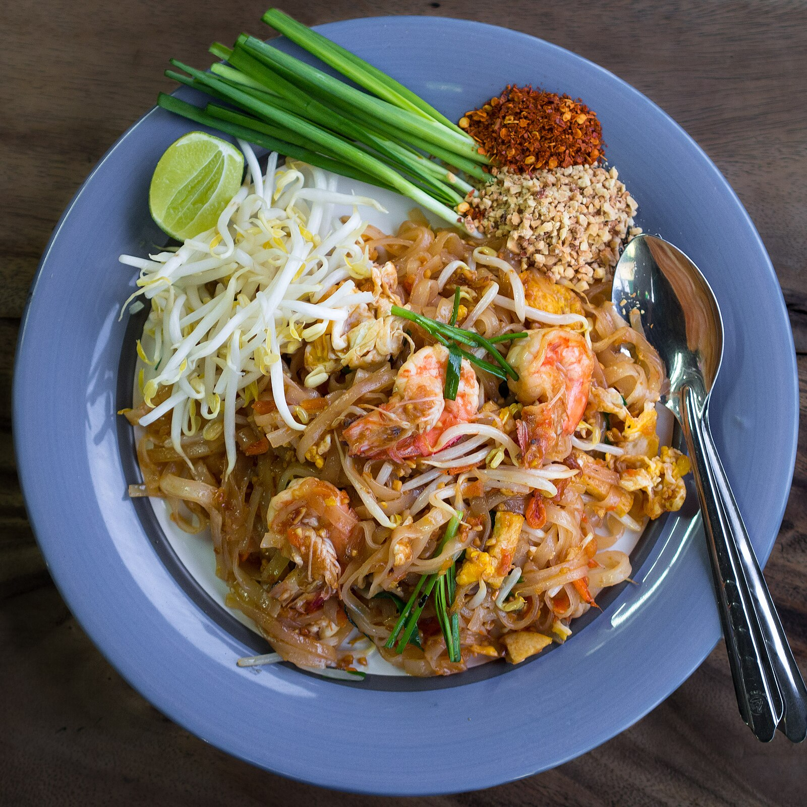
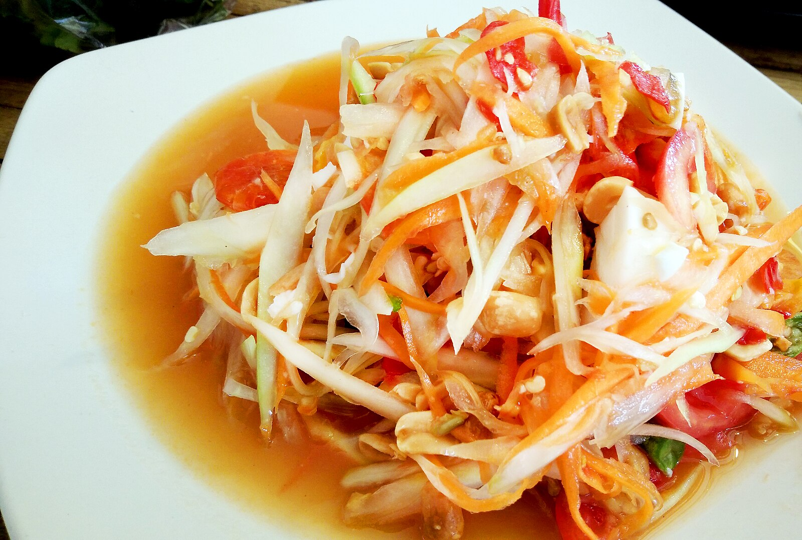

# タイ料理完全ガイド

*タイの市場に並ぶ色とりどりの新鮮なハーブとスパイス*

タイ料理は、熱帯の恵まれた自然環境と、中国、インド、マレーシアなど周辺諸国の影響を受けながら独自に発達した、世界で最も魅力的な料理の一つです。甘い、酸っぱい、辛い、しょっぱい、苦いの5つの味が絶妙に調和し、豊富なハーブとスパイスが織りなす香りの交響曲。バンコクの賑やかな屋台から、宮廷料理の伝統を受け継ぐ高級レストランまで、タイの食文化の奥深さと魅力をご紹介します。

## 🌶️ タイ料理の基本哲学

### 5つの味の調和「ロット・チャート」

*甘い、酸っぱい、辛い、しょっぱい、苦いが調和したタイ料理*

**タイ料理の味のバランス**
- **ワーン（甘い）**: ココナッツミルク、パームシュガー
- **プリアオ（酸っぱい）**: ライム、タマリンド、酢
- **ペット（辛い）**: 唐辛子、胡椒、生姜
- **ケム（しょっぱい）**: ナンプラー、塩、カピ
- **コム（苦い）**: 苦瓜、某些ハーブ類

**調理哲学**
- **バランス**: 一皿の中で5つの味が調和
- **新鮮さ**: その場で作り、すぐに食べる
- **香り**: ハーブとスパイスの香りを重視
- **食感**: サクサク、プリプリなど多様な食感

### 仏教とヒンドゥー教の影響

**宗教的背景**
- **仏教の教え**: 生き物への慈悲、適度な食事
- **ヒンドゥー教の影響**: スパイス使用、菜食の概念
- **精進料理**: 寺院での菜食料理文化
- **祭礼料理**: 宗教行事に関連した特別料理

**食材への敬意**
- **自然の恵み**: 季節の食材を大切に使用
- **無駄を出さない**: 食材を余すところなく活用
- **共有の精神**: みんなで分け合って食べる文化
- **感謝の気持ち**: 食材と作り手への感謝

## 🥥 タイ料理の基本食材

### 必須のハーブとスパイス

*タイ料理に欠かせない芳香豊かなハーブとスパイス*

**基本のハーブ**
- **レモングラス**: 爽やかな柑橘系の香り
- **カー（ガランガル）**: 生姜に似た根茎、独特の香り
- **バイ・ホーラパー（タイバジル）**: スイートバジルとは異なる香り
- **パクチー**: 根、茎、葉すべてを使用
- **マックルー（こぶみかんの葉）**: 独特の香りの柑橘系葉

**重要なスパイス**
- **プリック（唐辛子）**: 辛さの主役
- **プリック・キー・ヌー**: 小さいが非常に辛い唐辛子
- **グラチャイ（ケンプフェリア）**: 土の香りのする根茎
- **ホム・デーン（エシャロット）**: 小さな玉ねぎ
- **グラティアム（ニンニク）**: 小粒で香りが強い

### 基本調味料

**発酵調味料**
- **ナンプラー**: 魚を発酵させた魚醤、タイ料理の基本
- **カピ**: エビを発酵させたペースト
- **タオチアオ**: 大豆を発酵させた味噌様調味料
- **シーイウ**: タイの醤油、甘口と塩味がある

**甘味料と酸味料**
- **ナムターン・ピップ**: ココヤシの花蜜を煮詰めたパームシュガー
- **マナオ**: タイのライム、強い酸味と香り
- **ソム・マックアム**: タマリンドペースト
- **ナム・ソム・サイチュー**: 白酢

## 🍛 代表的なタイ料理

### パッタイ｜タイの国民的焼きそば

*エビと豆腐が入った本場のパッタイ*

**パッタイの基本**
- **米麺**: センレックという平たい米の麺
- **甘酸っぱい味**: タマリンド、パームシュガー、ナンプラーの調和
- **具材**: エビ、豆腐、もやし、ニラ、卵
- **トッピング**: ピーナッツ、ライム、唐辛子粉

**作り方のコツ**
1. **麺の戻し**: 適度な硬さに戻す
2. **高温調理**: 強火で手早く炒める
3. **味のバランス**: 甘み、酸味、塩味の調整
4. **香り**: 炒めることで引き出される香ばしさ

### トムヤムクン｜世界三大スープの一つ

*エビの旨味と香草の香りが際立つトムヤムクン*

**基本の材料**
- **クン（エビ）**: 新鮮な川エビまたは海老
- **レモングラス**: スープの香りの基本
- **カー**: 独特の香りと辛味
- **マックルーの葉**: 柑橘系の爽やかな香り
- **プリック・キー・ヌー**: 強烈な辛さ

**スープの種類**
- **トムヤムクン・ナムサイ**: 透明なスープ
- **トムヤムクン・ナムコン**: ココナッツミルク入り
- **トムヤムクン・ナムプリック・パオ**: チリペースト入り

### グリーンカレー｜タイカレーの王様

*ココナッツミルクの甘さと青唐辛子の辛さが絶妙なグリーンカレー*

**グリーンカレーペースト**
- **プリック・キー・ヌー・シャオ**: 青い小さな唐辛子
- **ガーリック**: ニンニクの香り
- **レモングラス**: 爽やかな香り
- **カー**: 独特の辛味
- **カピ**: エビペーストのコクと塩味

**調理のポイント**
1. **ペーストを炒める**: ココナッツミルクでペーストを炒める
2. **肉を加える**: 鶏肉などを加えて煮る
3. **野菜を投入**: ナス、竹の子などの野菜
4. **味の調整**: ナンプラー、パームシュガーで調味
5. **バジルで仕上げ**: タイバジルで香りをプラス

### ソムタム｜青パパイヤサラダ

*爽やかで辛酸っぱい青パパイヤサラダ*

**基本の材料**
- **マラコー**: 青パパイヤの千切り
- **マックアム**: タマリンドの酸味
- **プリック**: 唐辛子の辛味
- **マナオ**: ライムの爽やかな酸味
- **トゥア・ファクヤオ**: インゲンの食感

**地域別バリエーション**
- **ソムタム・タイ**: 中央部の甘めの味付け
- **ソムタム・イサーン**: 東北部の辛く塩辛い味
- **ソムタム・プラーラー**: 発酵魚ソース入り
- **ソムタム・ポン・ラ・マイ**: フルーツミックス

## 🏪 タイの食べ歩き文化

### 屋台料理｜庶民の味

*バンコクの路上に並ぶ活気ある屋台*

**代表的な屋台料理**
- **カオマンガイ**: タイ風チキンライス
- **クイッティアオ**: タイのラーメン
- **パッガパオ**: バジル炒めご飯
- **マンゴーとカオニャオ**: マンゴーともち米のデザート

**屋台の魅力**
- **安価**: リーズナブルな価格
- **新鮮**: 注文を受けてから調理
- **多様性**: 地方料理も楽しめる
- **コミュニケーション**: 地元の人との交流

### 市場グルメ

*新鮮な食材を使った市場での調理風景*

**有名な市場**
- **チャトゥチャック・ウィークエンド・マーケット**: バンコク最大の市場
- **フローティング・マーケット**: 水上市場の風情
- **ワロロット市場**: チェンマイの伝統的市場
- **トンブリー市場**: 地元密着型の市場

**市場での楽しみ方**
- **食材探し**: 珍しい野菜や果物の発見
- **試食**: 果物や調味料の味見
- **調理見学**: プロの手さばきを間近で見る
- **文化体験**: タイ人の日常生活を体感

## 🍜 地域別タイ料理の特色

### 北部タイ料理（ランナー料理）

*チェンマイを中心とした北部タイ料理の数々*

**特徴**
- **マイルドな味**: 辛さ控えめ、優しい味わい
- **ビルマの影響**: ミャンマーとの国境地帯の文化交流
- **山の幸**: 山菜、川魚、野生動物
- **発酵食品**: ナムプリック・ヌムなどの発酵調味料

**代表料理**
- **カオソーイ**: ココナッツカレーラーメン
- **サイウア**: ハーブソーセージ
- **ラープ・ムー**: 豚肉のサラダ
- **ガン・ホー・レイ**: ビルマ風カレー

### 東北部タイ料理（イサーン料理）

*豪快で力強いイサーン地方の料理*

**特徴**
- **塩辛い味**: ナムプラーを多用
- **発酵食品**: プラーラー（発酵魚ソース）
- **辛い料理**: 唐辛子を多用した刺激的な味
- **ラオスの影響**: 隣国ラオスとの共通文化

**代表料理**
- **ラープ**: 肉のサラダ
- **ガイヤーン**: 焼き鳥
- **パパイヤサラダ**: イサーン風ソムタム
- **スープ・ノーマイ**: 竹の子のスープ

### 南部タイ料理

*マレー半島の影響を受けた南部タイのスパイシーな料理*

**特徴**
- **非常に辛い**: 他地域より辛さが強烈
- **マレー・インドの影響**: スパイス使用が豊富
- **海の幸**: 新鮮な魚介類
- **ココナッツ**: ココナッツミルクの多用

**代表料理**
- **ガン・ソム**: 酸っぱ辛いカレー
- **カレー・ガイ**: 鶏肉のカレー
- **プラー・トード**: 魚の揚げ物
- **ロティ**: インド風のパン

## 🥭 タイのデザートと果物

### 伝統的なタイデザート

*色とりどりで美しいタイの伝統的なデザート*

**ココナッツ系デザート**
- **カオニャオ・マムアン**: マンゴーともち米
- **タプティム・グロープ**: ざくろ風ゼリー
- **ブアローイ**: ココナッツミルクの白玉団子
- **サンカヤー**: ココナッツカスタード

**米粉系デザート**
- **カノムクロック**: ココナッツ入りの小さなパンケーキ
- **カノムトム**: バナナの葉包み蒸し団子
- **カオトム・マット**: 竹筒蒸しもち米
- **ロティ・マタバ**: 甘いロティ

### 熱帯フルーツの楽園

*タイの豊富で美味しい熱帯フルーツの数々*

**王様フルーツ**
- **ドリアン**: 果物の王様、強烈な香りと濃厚な味
- **マンゴー**: 様々な品種、甘くてジューシー
- **ライチ**: 上品な甘さとフローラルな香り
- **ランブータン**: ライチに似た白い果肉

**日常的なフルーツ**
- **パパイヤ**: 青いものはサラダ、熟したものはデザート
- **パイナップル**: 甘酸っぱくてジューシー
- **ドラゴンフルーツ**: 美しい見た目と淡白な味
- **グアバ**: ビタミンC豊富な健康フルーツ

## 🍷 タイ料理と飲み物

### ビールとタイ料理

*辛いタイ料理に良く合うタイビール*

**タイのビール**
- **シンハー**: タイを代表するプレミアムビール
- **チャーン**: 象のマークで有名な人気ビール
- **レオ**: 庶民的で飲みやすいビール
- **タイガー**: シンガポール発だがタイでも人気

**ペアリングのコツ**
- **辛い料理**: 冷たいビールで辛さを和らげる
- **油っぽい料理**: ビールの苦味で口をすっきり
- **海鮮料理**: 軽めのビールで素材の味を活かす

### ソフトドリンクとデザート飲料

**タイ独特の飲み物**
- **タイティー**: コンデンスミルク入りの甘い紅茶
- **ナムマナオ**: ライムジュース
- **ナムターンピップ**: パームシュガージュース
- **ナムココナッツ**: 新鮮なココナッツウォーター

## 🏠 家庭でタイ料理を作る

### 基本調味料の揃え方

*家庭でタイ料理を作るための基本調味料*

**必須調味料**
- **ナンプラー**: 日本でも入手可能
- **オイスターソース**: タイブランドがおすすめ
- **スイートチリソース**: 甘辛い万能ソース
- **ココナッツミルク**: 缶詰でも十分美味しい

**揃えておくと便利**
- **パームシュガー**: なければ黒糖で代用
- **タマリンドペースト**: 酸味の重要な調味料
- **フィッシュソース**: ナンプラーの別ブランド
- **チリペースト**: 辛味の調整に

### 簡単タイ料理レシピ

**ガパオライス（バジル炒めご飯）**
1. **材料**: 鶏ひき肉、バジル、唐辛子、ニンニク
2. **調味料**: ナンプラー、オイスターソース、砂糖
3. **作り方**: 強火で炒めて目玉焼きをトッピング
4. **ポイント**: バジルは最後に加えて香りを活かす

**トムヤムクン風スープ**
1. **材料**: エビ、しめじ、トマト
2. **調味料**: ナンプラー、レモン汁、チリペースト
3. **作り方**: 具材を煮て調味料で味を調える
4. **仕上げ**: パクチーを散らす

## まとめ

タイ料理は、豊かな自然の恵みと長い歴史の中で培われた知恵が結晶した、世界で最も魅力的な料理文化の一つです。5つの味の絶妙なバランス、フレッシュなハーブとスパイスの香り、そして何より食べる人を幸せにする温かい心遣いが込められています。

*心を込めて美しく盛り付けられたタイ料理*

バンコクの賑やかな屋台から宮廷料理の伝統まで、タイ料理の世界は実に多彩で奥深く、一度その魅力に触れると、きっと虜になってしまうでしょう。新鮮な食材、熟練の技、そして何より「サヌック」（楽しい）の精神で作られるタイ料理を、ぜひお楽しみください。*อร่อยมาก!*（アロイマーク＝とても美味しい！）