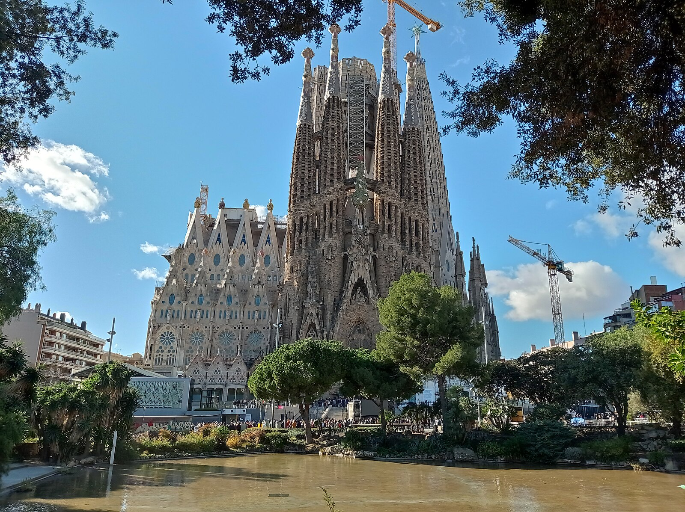
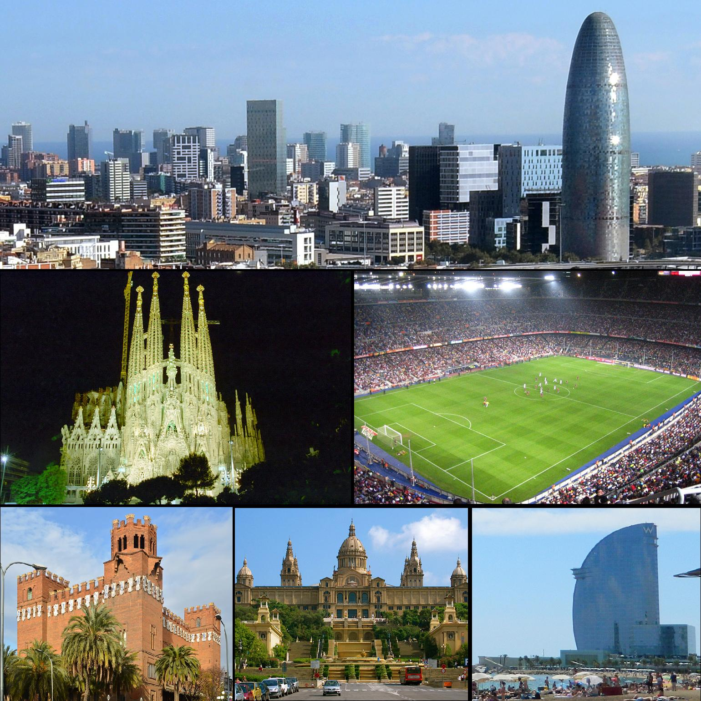
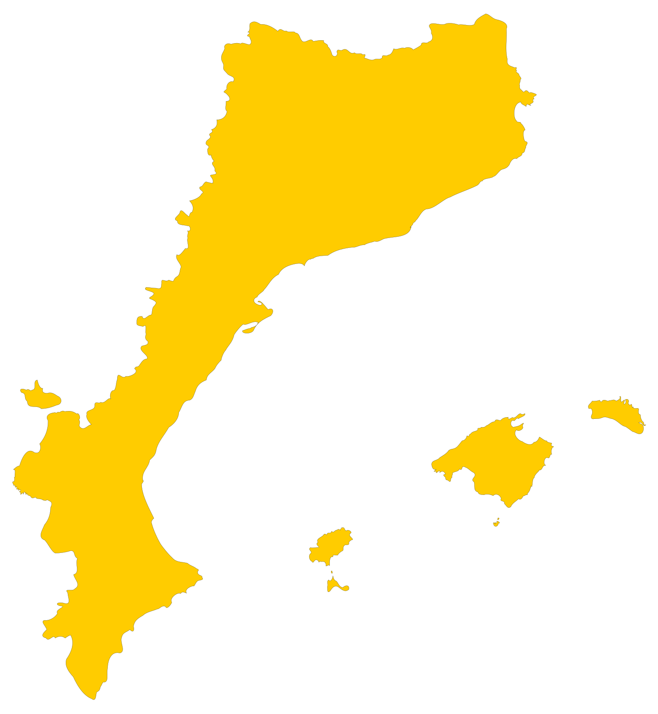
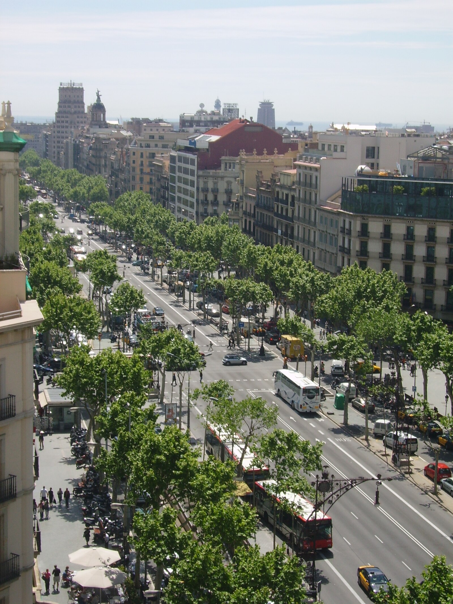

# バルセロナ・ガウディ完全ガイド

*地中海に面した美しいバルセロナの街並み*

地中海の真珠と呼ばれるバルセロナは、天才建築家アントニ・ガウディの作品群と、情熱的なカタルーニャ文化が織りなす魅惑的な都市です。2,000年の歴史を持つこの街には、古代ローマの遺跡からモダニズム建築、そして最先端のアートまで、あらゆる時代の美が共存しています。芸術、グルメ、ビーチ、そして陽気な人々が作り出すバルセロナの魔法を、存分にお楽しみください。

## 🏰 ガウディ建築の傑作群

### サグラダ・ファミリア｜未完の聖堂

*石に刻まれた聖書の物語、サグラダ・ファミリアの精緻な彫刻*

1882年着工、2026年完成予定（ガウディ没後100年）の世界で最も有名な未完成建築。140年以上かけて建設され続ける奇跡の聖堂です。

**見どころ**
- **生誕のファサード**: キリストの誕生を表現した東面
- **受難のファサード**: キリストの受難を表現した西面
- **栄光のファサード**: 現在建設中の南面（メインエントランス）
- **内部**: 森をイメージした柱と天井の美しさ
- **塔**: エレベーターで上がる圧巻の360度パノラマ

**見学のコツ**
- **事前予約必須**: 特に塔への入場は数ヶ月前から予約
- **音声ガイド**: ガウディの思想と建築技法を理解
- **早朝または夕方**: 美しい光が差し込む時間帯がおすすめ

### パーク・グエル｜おとぎの国の公園

*色とりどりのモザイクタイルが美しいパーク・グエルのベンチ*

ガウディが手がけた住宅地計画の一部で、現在は市民憩いの公園として親しまれています。

**ハイライト**
- **正面階段**: カラフルなトカゲ（サラマンドラ）の噴水
- **市場回廊**: 86本の柱が支える天井
- **中央広場**: 波打つベンチからの市街地パノラマ
- **ガウディの家**: 現在は博物館として公開
- **自然との調和**: 地形を活かした独創的な設計

### カサ・バトリョ｜龍の背の家

*夜にライトアップされたカサ・バトリョの幻想的な外観*

海をイメージした外観と、龍の背のような屋根が特徴的な集合住宅です。

**見学ポイント**
- **波打つ外観**: 海の波を表現したバルコニーと窓
- **龍の屋根**: カタルーニャ伝説の聖ジョルディと龍の物語
- **光の中庭**: 上層階ほど薄い青タイルで光を調整
- **貴族の部屋**: ガウディ設計の家具と装飾
- **屋上テラス**: バルセロナ市街を一望

### カサ・ミラ（ラ・ペドレラ）｜石切り場の家

*波のような曲線が美しいカサ・ミラの外観*

「石切り場」を意味するラ・ペドレラの愛称で親しまれる、ガウディ設計の最後の住宅建築です。

**特徴的な要素**
- **波打つ外観**: 直線を一切使わない有機的なフォルム
- **鉄製バルコニー**: 海藻をイメージした装飾的な手すり
- **屋上**: 煙突を装飾化した彫刻の森
- **中庭**: 自然光を取り入れる楕円形の空間
- **カタルーニャ・ボルト**: 伝統的な天井構造の応用

## 🏛️ 歴史地区の魅力

### ゴシック地区｜中世の迷宮

*中世の面影を残すゴシック地区の石畳の路地*

バルセロナ最古の地区で、古代ローマ時代から中世にかけての建造物が残っています。

**必見スポット**
- **カテドラル**: バルセロナ大聖堂の荘厳なゴシック建築
- **王の広場**: 中世の王宮に囲まれた美しい広場
- **サンタ・エウラリア大聖堂**: バルセロナの守護聖人を祀る聖堂
- **ピカソ博物館**: 若き日のピカソ作品を展示

### エル・ボルン地区｜アーティスティックエリア

*トレンディなアートギャラリーが集まるエル・ボルン地区*

かつての商業地区が、現在はアーティストやクリエイターが集まるおしゃれなエリアに変貌しました。

**文化スポット**
- **ピカソ美術館**: 青の時代から薔薇色の時代まで
- **サンタ・マリア・デル・マル教会**: カタルーニャ・ゴシックの傑作
- **ボルン市場**: 現在は文化センターとして活用
- **モンカダ通り**: 中世の貴族邸宅が並ぶ美しい石畳の通り

## 🍷 カタルーニャのグルメ体験

### タパス文化｜小皿料理の楽しみ

*色とりどりの美味しそうなタパスの盛り合わせ*

スペインの代表的な食文化タパスは、友人や家族との社交の場でもあります。

**定番タパス**
- **パタタス・ブラバス**: スパイシーソースのじゃがいも
- **ハモン・イベリコ**: スペイン最高峰の生ハム
- **トルティーヤ・エスパニョーラ**: スペイン風オムレツ
- **ガンバス・アル・アヒージョ**: エビのガーリック炒め
- **パン・コン・トマテ**: トマトとオリーブオイルのパン

### パエリア｜バレンシア発祥の国民食

*新鮮な魚介類をふんだんに使った本格パエリア*

**パエリアの種類**
- **パエリア・デ・マリスコ**: 海老、ムール貝、イカの海鮮パエリア
- **パエリア・ミクスタ**: 肉と魚介の両方を使ったミックス
- **パエリア・ベヘタリアーナ**: 野菜だけのベジタリアン向け
- **アロス・ネグロ**: イカ墨を使った黒いパエリア

### 地元ワインとカヴァ

*カタルーニャ地方の美味しいワインとカヴァの試飲*

**カタルーニャのワイン**
- **カヴァ**: スペイン産スパークリングワイン
- **プリオラート**: 世界的に評価の高い赤ワイン産地
- **ペネデス**: 白ワインで有名な産地
- **モンサン**: バランスの良い赤ワイン

## 🏖️ 地中海のビーチライフ

### バルセロネータ・ビーチ｜都市に最も近いビーチ

*夏の太陽の下で賑わうバルセロネータ・ビーチ*

市内中心部から地下鉄で15分、都市の利便性とビーチリゾートの両方を楽しめます。

**ビーチアクティビティ**
- **日光浴**: 地中海の温暖な気候を満喫
- **ビーチバレー**: 設備の整ったコートで楽しめる
- **ウォータースポーツ**: カイトサーフィンやセーリング
- **チリンギート**: ビーチサイドのレストランで新鮮な魚介類

### オリンピック港｜近代的なマリーナ

*1992年バルセロナオリンピックのレガシー、オリンピック港*

1992年バルセロナオリンピックのために建設された近代的な港湾エリア。

**楽しみ方**
- **高級レストラン**: 港を見下ろすテラスでの食事
- **ナイトライフ**: カジノやクラブでの夜遊び
- **ショッピング**: マレマグナム・ショッピングセンター
- **散歩道**: 海岸線沿いの美しい遊歩道

## 🎨 アートとカルチャー

### ピカソ美術館｜天才の青春時代

*ピカソの代表的な青の時代の作品*

バルセロナで青春時代を過ごしたピカソの初期作品を中心に展示。

**コレクションハイライト**
- **初期の写実作品**: 10代の驚異的な技術
- **青の時代**: 憂鬱で美しい青色の作品群
- **ラス・メニーナス連作**: ベラスケスの名画をピカソ流に解釈
- **陶芸作品**: 晩年の創作活動

### ミロ美術館｜カタルーニャの巨匠

*ミロの色彩豊かな抽象表現作品*

バルセロナ出身の画家ホアン・ミロの作品を世界最大規模で展示。

**見どころ**
- **大型壁画**: 美術館の外壁を飾る巨大作品
- **彫刻庭園**: 屋外に配置された立体作品
- **実験的作品**: 従来の絵画概念を覆す革新的な表現

## 🎵 音楽とパフォーマンス

### カタルーニャ音楽堂｜モデルニスモの宝石

*天井を飾る美しいステンドグラスのスカイライト*

ガウディと同時代の建築家モンタネールが設計した音楽ホール。

**建築的特徴**
- **ステンドグラス**: 天井の巨大なスカイライト
- **モザイク装飾**: 壁面を彩る色とりどりのタイル
- **彫刻装飾**: カタルーニャの音楽家を表現した彫刻群
- **音響効果**: 世界屈指の音響設計

### フラメンコ｜アンダルシアの情熱

*魂を揺さぶる情熱的なフラメンコパフォーマンス*

**本格的な鑑賞場所**
- **タブラオ・コルドベス**: ランブラス通りの老舗
- **パラシオ・デル・フラメンコ**: 豪華な会場での本格ショー
- **ロス・タラントス**: アーティスティックな演出

## 🛍️ ショッピング天国

### ランブラス通り｜バルセロナの大動脈

*いつも人で賑わうランブラス通りの歩行者天国*

カタルーニャ広場から港まで続く1.2kmの歩行者天国。

**見どころ・楽しみ方**
- **大道芸人**: 生きている彫刻などユニークなパフォーマンス
- **ボケリア市場**: 新鮮な食材とグルメの宝庫
- **花屋**: 色とりどりの花が並ぶ伝統的な花屋台
- **カフェテラス**: 人間観察を楽しみながらのカフェタイム

### グラシア通り｜高級ショッピング街

*世界の高級ブランドが集まるグラシア通り*

**高級ブランド**
- **ルイ・ヴィトン**: ガウディ建築に囲まれた旗艦店
- **グッチ**: モデルニスモ建築の店舗
- **エル・コルテ・イングレス**: スペイン最大手デパート

## 🎉 祭りとイベント

### サン・ジョルディの日（4月23日）｜カタルーニャの愛の日

*愛の証として交換されるバラと本*

カタルーニャの守護聖人の日で、男性は女性にバラを、女性は男性に本を贈る美しい伝統があります。

### ラ・メルセ祭（9月下旬）｜バルセロナ最大の祭り

*カタルーニャ伝統の人間の塔（カステル）*

**祭りのハイライト**
- **カステル**: 人間が積み重なって作る塔
- **ジガンツ**: 巨大な人形のパレード
- **コレフォック**: 火龍や悪魔の火祭り
- **無料コンサート**: 街中で開催される音楽イベント

## 💡 バルセロナ旅行のコツ

### 交通システム
- **メトロ**: 8路線で市内をカバー、T-10回数券がお得
- **バス**: 夜間バス（ニトゥバス）も運行
- **バイシング**: 市内自転車シェアリングシステム
- **タクシー**: 黄色と黒のツートンカラー

### 治安と注意事項
- **スリ対策**: 観光地とメトロ内は特に注意
- **シエスタ**: 午後2-5時は多くの店が休業
- **夕食時間**: 夜9-10時からが一般的
- **日曜日**: 多くの美術館・店舗が休業

### 言語
- **カタルーニャ語**: 第一公用語だが、スペイン語も通じる
- **英語**: 観光地では比較的通じる
- **基本挨拶**: "Hola"（こんにちは）、"Gràcies"（ありがとう）

### 予算目安
- **ホテル**: 1泊8,000-25,000円
- **食事**: 1食1,500-6,000円
- **交通**: 1日券約1,000円
- **観光**: ガウディ建築群で1日15,000-20,000円

## 🌅 日帰り観光地

### モンセラット｜神秘の山

*奇岩に囲まれた神秘的なモンセラット修道院*

バルセロナから電車で1時間、カタルーニャの聖地として信仰を集める修道院。

**見どころ**
- **黒いマリア像**: カタルーニャの守護聖母
- **少年聖歌隊**: 世界最古の少年合唱団
- **ハイキング**: 奇岩群の絶景トレイル
- **ケーブルカー**: 山頂からのパノラマビュー

### コスタ・ブラバ｜白い海岸

*地中海の宝石のように美しいコスタ・ブラバの入り江*

「荒々しい海岸」を意味する地中海沿いのリゾート地。

**おすすめ都市**
- **ジローナ**: 中世の城壁都市
- **カダケス**: ダリゆかりの白い町
- **トッサ・デ・マール**: 美しい入り江のリゾート地

## まとめ

バルセロナは、ガウディの天才的な建築群、2,000年の歴史、地中海の美しいビーチ、そして陽気なカタルーニャ文化が見事に調和した、世界でも類を見ない魅力的な都市です。

*地中海に沈む美しい夕日とバルセロナの街並み*

アートに情熱を注ぎ、美食を愛し、人生を楽しむカタルーニャの人々と出会い、きっとあなたもバルセロナの魔法にかかることでしょう。*¡Benvinguts a Barcelona!*（バルセロナへようこそ！）