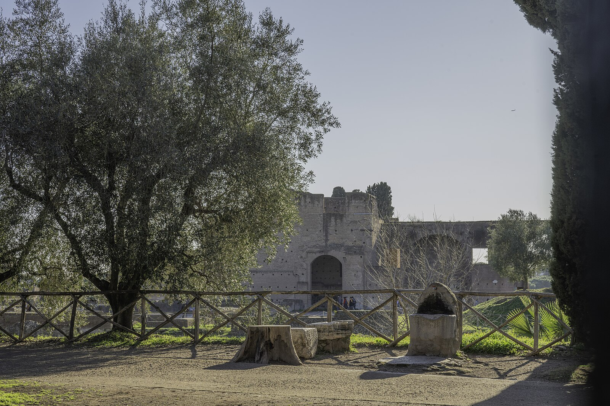
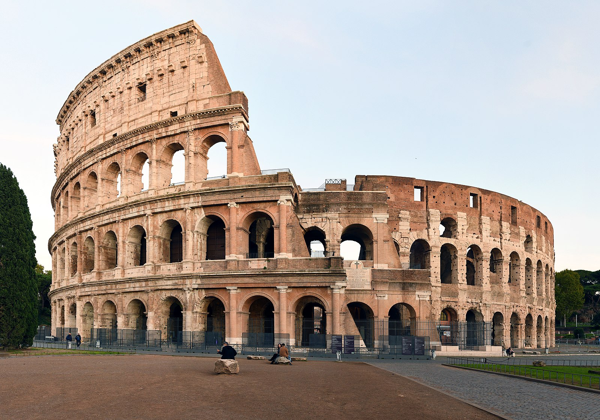
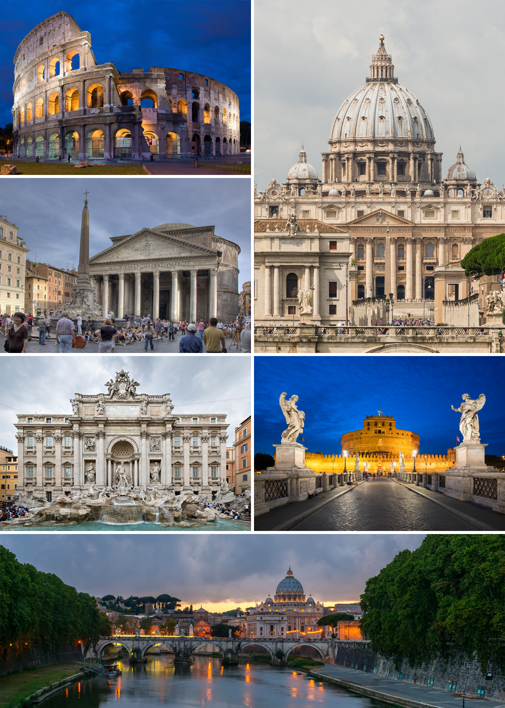

# ローマ永遠の都ガイド

*古代ローマ帝国の栄光を物語るフォロ・ロマーノ*

「すべての道はローマに通ず」という格言通り、ローマは西洋文明の源流であり、3,000年の歴史が層を成す永遠の都です。古代遺跡、ルネサンス芸術、バロック建築、そして現代イタリアの活気が見事に共存するこの街では、歩くたびに新たな発見があります。

## 🏛️ 古代ローマの遺産

### コロッセオ｜古代の円形闘技場

*剣闘士が戦った古代コロッセオの内部*

西暦80年完成、収容人数5万人の古代世界最大の円形闘技場。

**見学ポイント**
- **アリーナフロア**: 剣闘士が戦った舞台を復元
- **地下構造**: 猛獣や舞台装置を収納した複雑な地下施設
- **上層階**: ローマ市街を一望できる絶景スポット

### フォロ・ロマーノ｜古代ローマの中心地

古代ローマ帝国の政治・経済・宗教の中心地。現在は遺跡群として保存されています。

**主要遺跡**
- **凱旋門**: 皇帝の戦勝を記念した門
- **神殿跡**: ヴェスタ神殿やサトゥルヌス神殿
- **バジリカ**: 古代の裁判所や商業施設

### パンテオン｜完璧なドーム建築

*天窓から光が差し込むパンテオンの神秘的な空間*

西暦126年完成、現在も使用される世界最古のドーム建築。

---

# シドニー完全ガイド｜南半球の輝く宝石

*シドニーハーバーブリッジとオペラハウスの美しいコラボレーション*