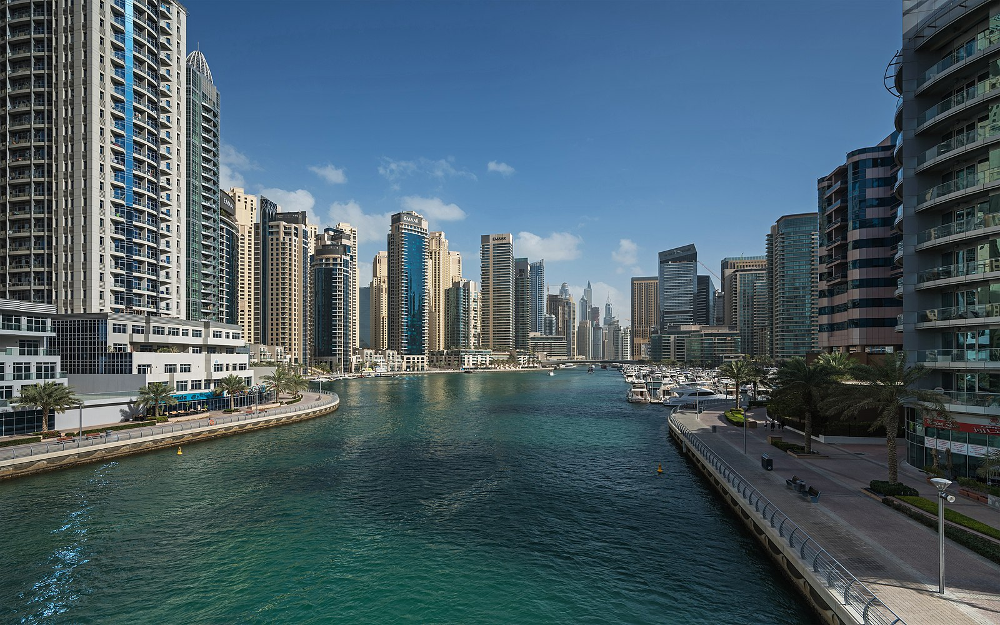
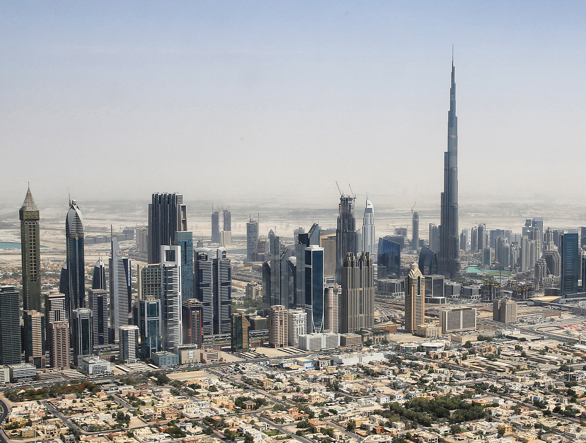
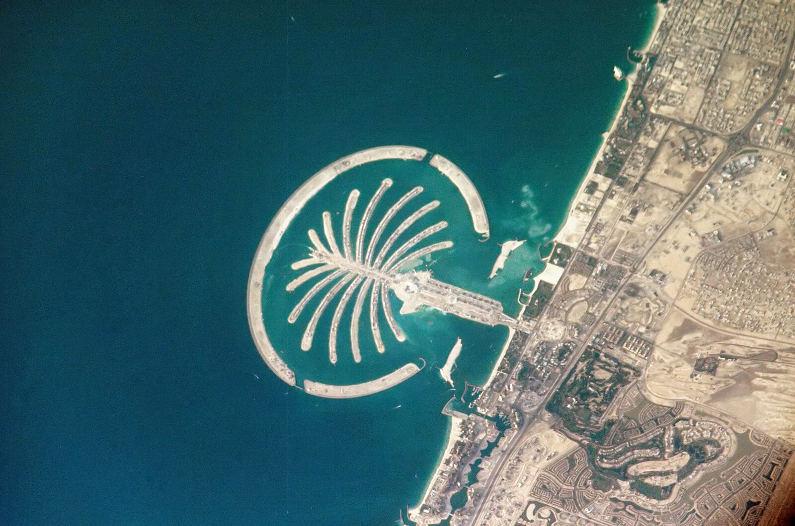
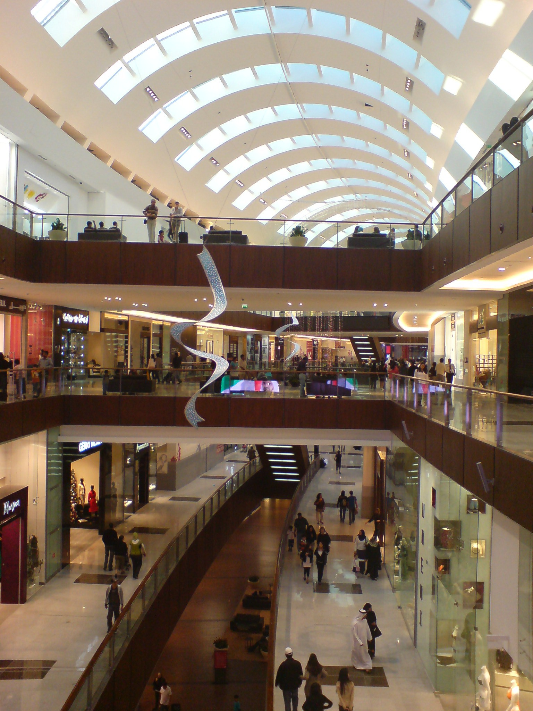
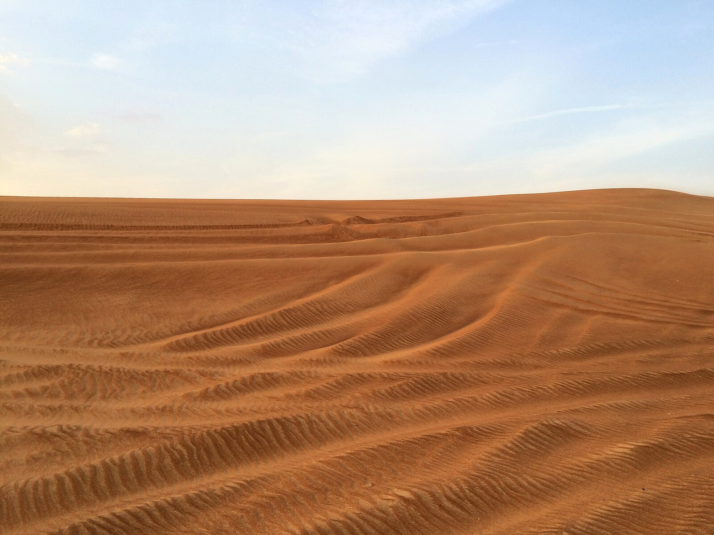
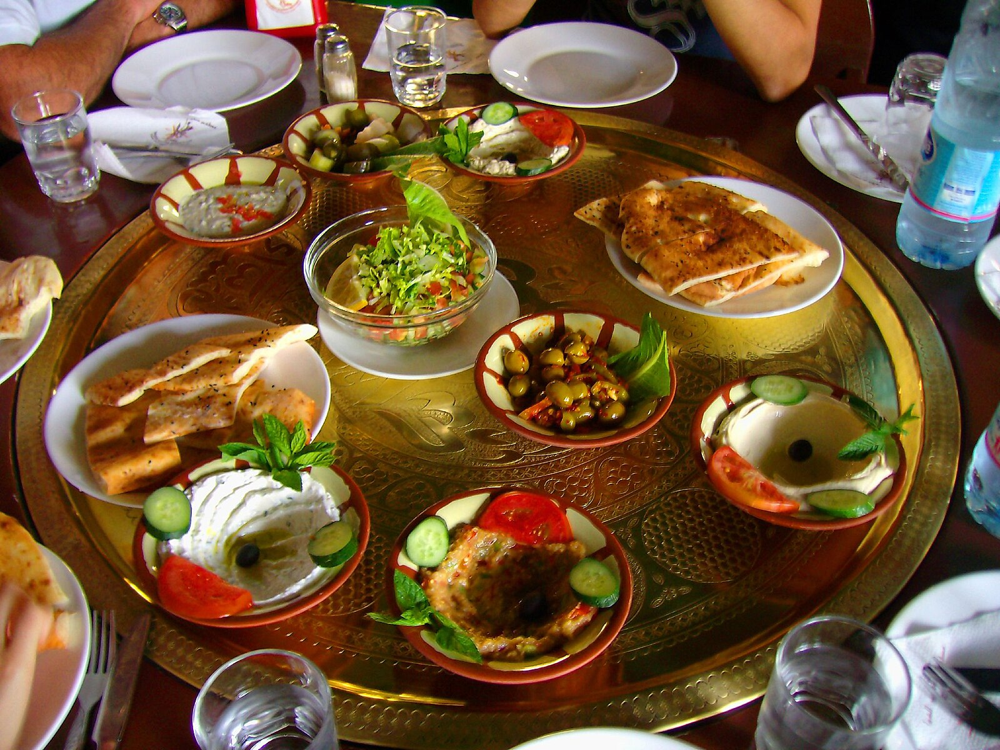
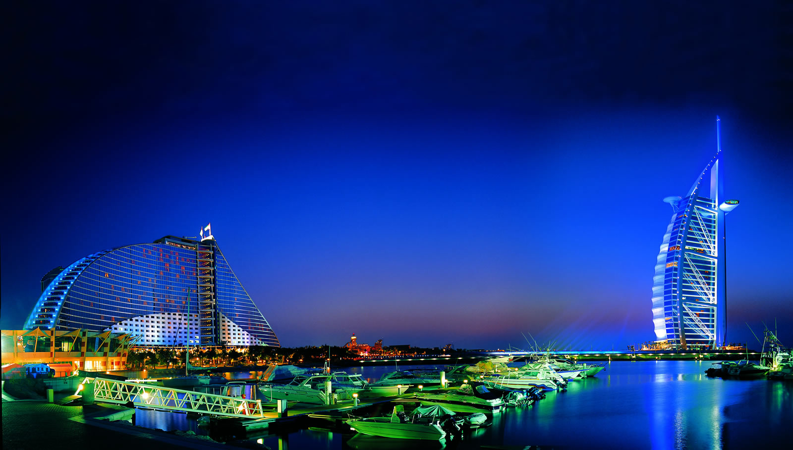

# ドバイ豪華体験ガイド

*未来都市ドバイマリーナの輝く超高層ビル群*

21世紀の奇跡の都市ドバイは、わずか50年で砂漠の小さな漁村から世界有数の国際都市へと変貌を遂げました。世界一の超高層ビル、人工島、砂漠のオアシス、そして最高級のホスピタリティが、訪れる人々に夢のような体験を提供します。

## 🏗️ 建築の奇跡

### ブルジュ・ハリファ｜世界一の超高層ビル

*地上828mから見下ろすドバイの壮大なパノラマ*

高さ828m、200階建ての世界一高いビル。

**展望台**
- **At The Top（124・125階）**: 標準的な展望台
- **At The Top SKY（148階）**: プレミアム展望台
- **ラウンジ体験**: 優雅なアフタヌーンティー

### パーム・ジュメイラ｜人工島の傑作

*宇宙からも見える巨大なヤシの木型人工島*

ヤシの木の形をした世界最大の人工島。

**見どころ**
- **アトランティス・ザ・パーム**: 豪華リゾートホテル
- **アクアアドベンチャー**: 中東最大のウォーターパーク
- **ロスト・チェンバーズ**: 古代アトランティスをテーマにした水族館

## 🛍️ ショッピング天国

### ドバイモール｜世界最大級のショッピングモール

*世界の高級ブランドが集まるドバイモール*

1,200以上の店舗を有する巨大ショッピングセンター。

**アトラクション**
- **ドバイ水族館**: モール内の巨大水槽
- **アイススケートリンク**: 砂漠の国でアイススケート
- **ドバイファウンテン**: 世界最大級の音楽噴水ショー

### ゴールドスーク｜伝統的な金市場

*眩いばかりの金製品が並ぶゴールドスーク*

世界最大級の金市場で、300以上の金細工店が軒を連ねます。

## 🏜️ 砂漠体験

### デザートサファリ｜砂丘の冒険

*砂丘を駆け抜ける爽快な4WDサファリ体験*

**アクティビティ**
- **デューン・バッシング**: 4WDで砂丘を駆け抜ける
- **キャメルライド**: らくだ乗り体験
- **サンドボード**: 砂丘でのスノーボード
- **ベドウィンディナー**: 伝統的な砂漠のディナーショー

### アル・マハ｜砂漠のラグジュアリーリゾート

*砂漠に佇む究極のラグジュアリーリゾート*

砂漠保護区内にある世界最高級のデザートリゾート。

## 🍽️ 国際グルメ

### 中東料理

*スパイス豊かな伝統的中東料理*

**名物料理**
- **フムス**: ひよこ豆のペースト
- **シャワルマ**: 中東風ケバブ
- **マンサフ**: ヨルダンの国民料理
- **バクラワ**: 蜂蜜とナッツのお菓子

### 高級レストラン

世界中の有名シェフがドバイに集結。

**ミシュラン星付きレストラン**
- **ロバート**: フレンチの巨匠の店
- **ゼロ・グラヴィティ**: 革新的なモダン料理

## 🏨 究極のホスピタリティ

### 7つ星ホテル｜ブルジュ・アル・アラブ

*世界で唯一の7つ星ホテルの豪華なスイートルーム*

帆船の形をした世界で唯一の7つ星ホテル。

**特別なサービス**
- **ロールスロイス送迎**: 空港からの専用送迎
- **ヘリコプター着陸**: 屋上ヘリパッド
- **24時間バトラーサービス**: 専属執事によるおもてなし

## まとめ

ドバイは、人間の想像力と技術力が生み出した21世紀の奇跡の都市です。伝統的なアラブ文化と最先端の未来都市が共存し、世界中から集まる人々が作り出すコスモポリタンな魅力に満ちています。

*煌びやかに輝くドバイの夜景*

一度ドバイを訪れると、その規模と豪華さに圧倒され、人類の可能性を信じたくなることでしょう。*مرحباً بكم في دبي*（ドバイへようこそ！）