# サントリーニ島ギリシャ完全ガイド

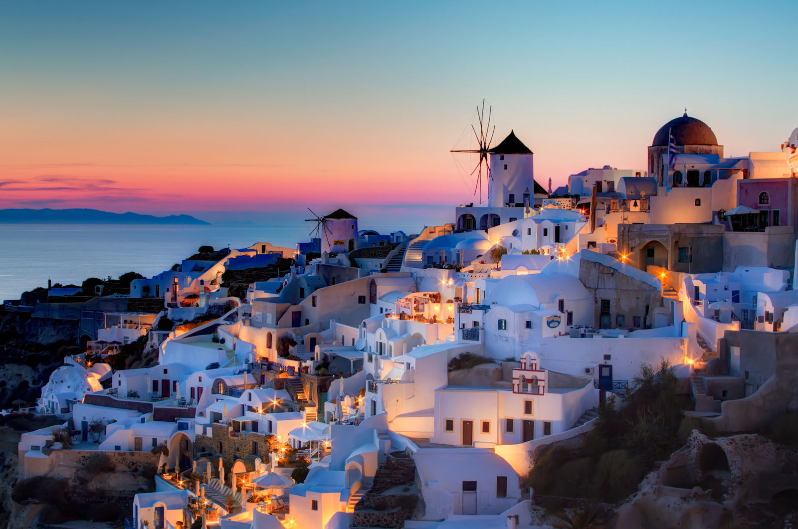
*世界で最も美しいと言われるイア村からの夕日*

エーゲ海に浮かぶサントリーニ島は、紺碧の海と真っ白な建物のコントラストが織りなす絶景で、世界中の旅行者を魅了し続けています。火山活動によって形成されたこの島は、3,500年前のミノア文明の遺跡から現代のリゾートライフまで、時を超えた美しさと神秘性に満ちています。

## 🌅 絶景スポット

### イア村｜世界一美しい夕日

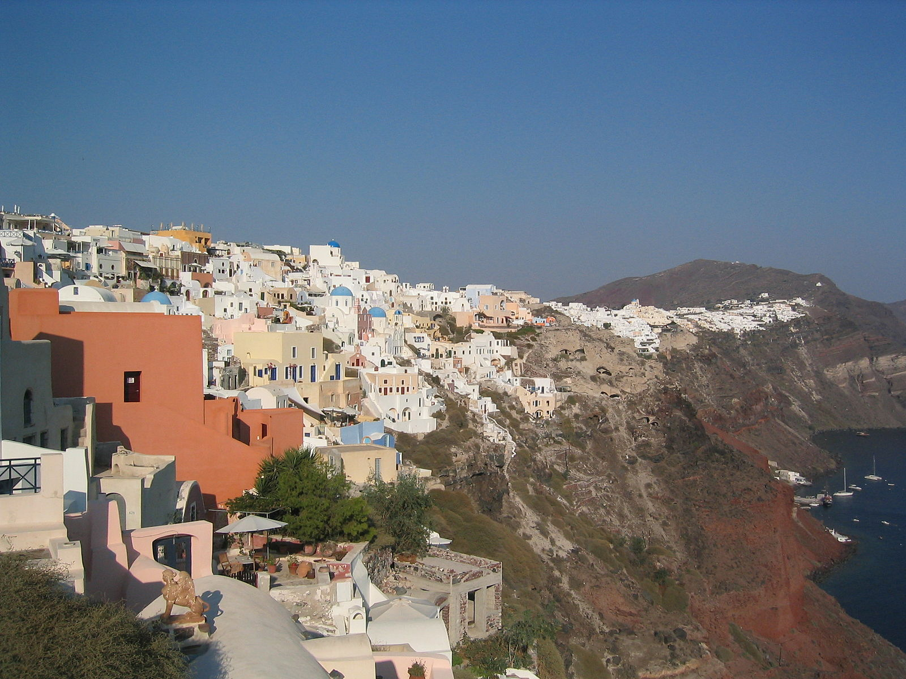
*断崖に建つイア村の伝統的なキクラデス建築*

サントリーニ島北西端にある小さな村で、世界で最も美しい夕日が見られる場所として有名です。

**見どころ**
- **カルデラ展望台**: 火山島を一望する絶景ポイント
- **風車跡**: 島の歴史を物語る古い風車
- **アモウディ湾**: 漁村の風情が残る小さな港
- **夕日スポット**: 毎日数百人が集まる夕日鑑賞の聖地

**夕日鑑賞のコツ**
- **到着時間**: 日没2時間前には到着がおすすめ
- **撮影スポット**: 城塞跡周辺がベストアングル
- **レストラン予約**: テラス席は数ヶ月前から予約必須

### フィラ｜島の中心地

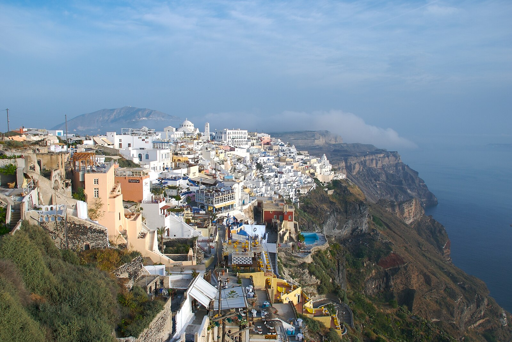
*カルデラの絶景を楽しめるフィラの遊歩道*

島の首都で、ショッピングやレストランが集中するエリア。

**アクティビティ**
- **ケーブルカー**: 旧港との往復で絶景を楽しむ
- **遊歩道散策**: フィラからイアまでの約10kmのハイキング
- **博物館**: 先史時代博物館で古代文明を学ぶ

### イメロヴィグリ｜静寂の村

観光客が比較的少ない静かな村で、よりゆったりとした時間を過ごせます。

**特徴**
- **スカロス・ロック**: 海に突き出た巨大な岩山
- **高級ホテル**: 崖沿いに建つラグジュアリーリゾート
- **教会**: 青いドームの美しい正教会

## 🏖️ 独特のビーチ

### レッドビーチ｜赤い砂のビーチ

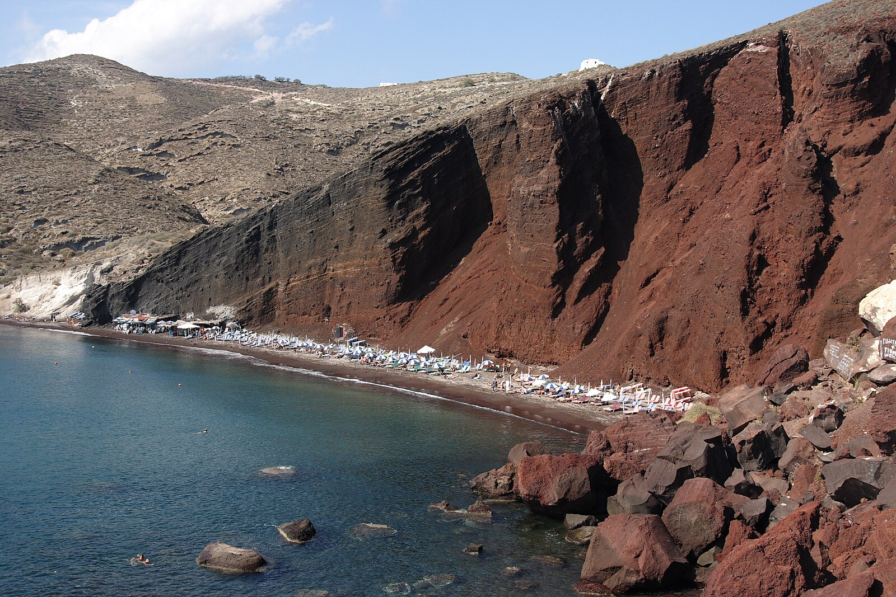
*火山活動が生み出した幻想的なレッドビーチ*

火山活動によって形成された赤い岩と黒い砂が特徴的なビーチ。

**特徴**
- **赤い崖**: 酸化鉄を含む火山岩の断崖
- **黒い砂**: 火山活動由来のミネラル豊富な砂
- **シュノーケリング**: 透明度の高い海で海中探索

### ブラックビーチ（カマリ）｜黒砂のリゾートビーチ

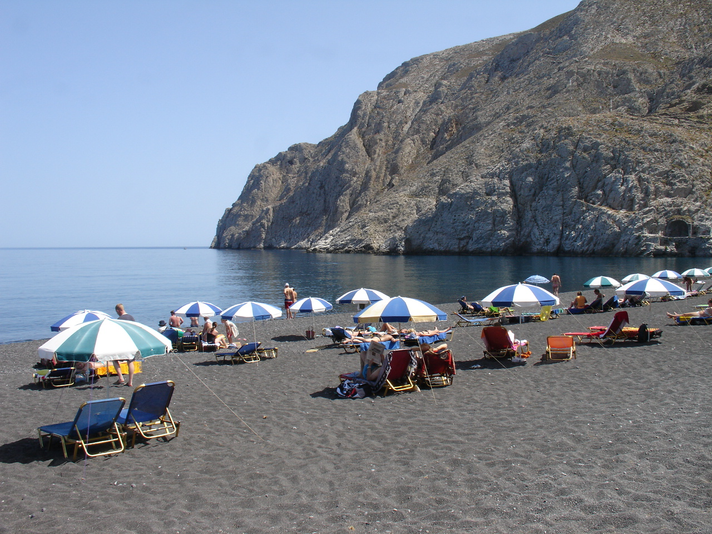
*火山島特有の美しい黒砂のカマリビーチ*

島で最も設備が整ったビーチリゾートエリア。

**施設・アクティビティ**
- **ビーチバー**: 海を眺めながらのカクテルタイム
- **ウォータースポーツ**: ジェットスキーやダイビング
- **レストラン**: 新鮮な魚介類料理
- **ホテル**: ビーチフロントの快適なリゾート

### ペリッサビーチ｜家族向けの静かなビーチ

カマリの南に位置する、より静かで家族連れに人気のビーチ。

## 🍷 ワインと美食

### 火山性土壌のワイン

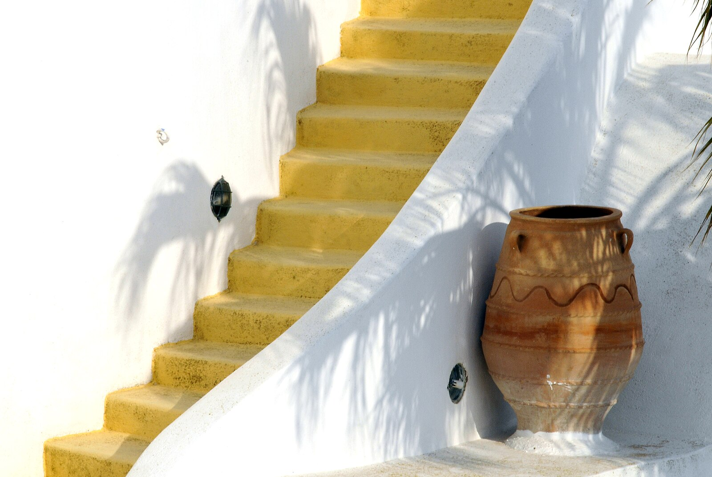
*火山性土壌で育つ独特なバスケット状のブドウ畑*

火山性土壌とエーゲ海の気候が生み出す独特なワイン。

**特徴的なワイン**
- **アシルティコ**: 島固有の白ブドウ品種
- **ニクテリ**: 伝統的な甘口白ワイン
- **ヴィンサント**: デザートワインの傑作

**ワイナリー巡り**
- **サント・ワインズ**: 絶景テラスでのテイスティング
- **ヴェンツィオス**: 家族経営の伝統的ワイナリー
- **アルティス・ワイナリー**: モダンな設備の新興ワイナリー

### ギリシャ料理

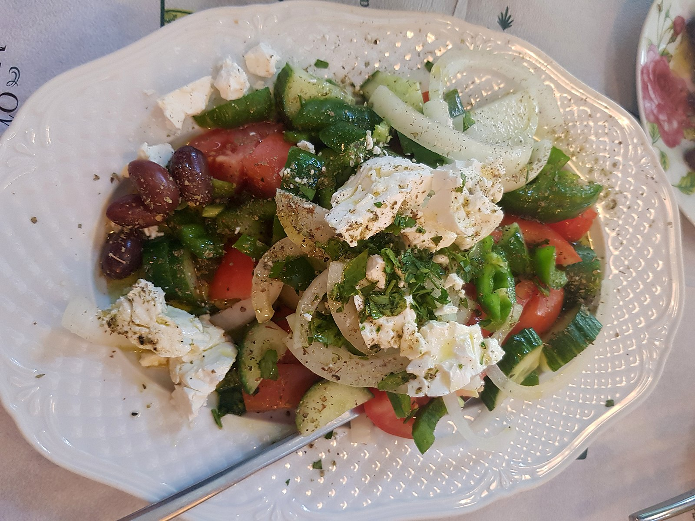
*エーゲ海の恵みを活かした新鮮な魚介料理*

**代表的料理**
- **ムサカ**: ギリシャの国民食、茄子とひき肉のグラタン
- **スヴラキ**: ギリシャ風串焼き肉
- **ファバ**: サントリーニ名物の黄色い豆料理
- **トマトケフテデス**: 島特産チェリートマトのフリッター
- **グリークサラダ**: フェタチーズとオリーブの伝統サラダ

### 島の特産品

**ユニークな食材**
- **チェリートマト**: 島の火山性土壌で育つ甘いトマト
- **ファバ豆**: 黄色い割れ豆、島の代表的食材
- **ケッパー**: 塩漬けにして料理のアクセントに

## 🏛️ 歴史と文化

### アクロティリ遺跡｜古代ミノア文明

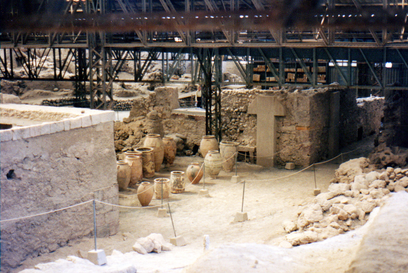
*3,500年前の火山噴火で保存された古代都市アクロティリ*

紀元前1600年頃の火山噴火で埋もれた古代都市。

**見どころ**
- **フレスコ画**: 鮮やかに保存された古代の壁画
- **建築技術**: 3階建ての高度な建築物
- **排水システム**: 古代の上下水道システム
- **陶器**: 日常生活を物語る生活用品

### 伝統的建築

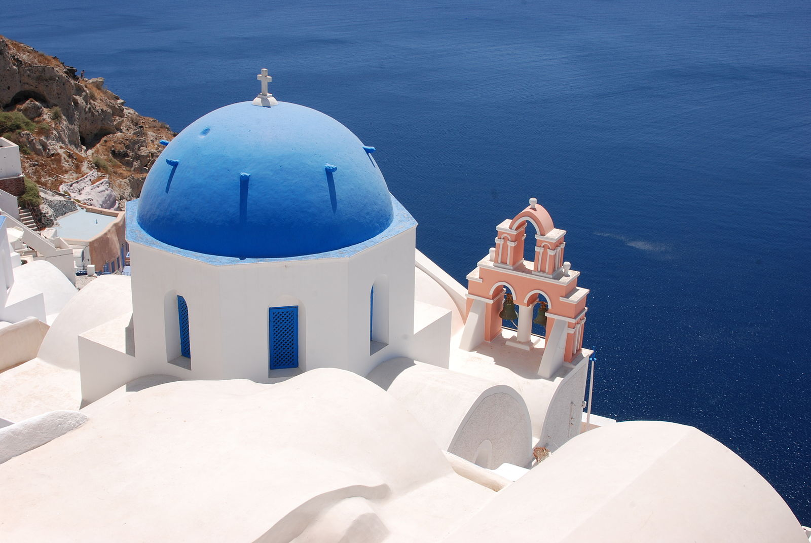
*白と青のコントラストが美しいキクラデス建築*

**建築の特徴**
- **白い壁**: 強い日差しを反射する実用的な色
- **青いドーム**: ギリシャ正教会の特徴的な屋根
- **洞窟住宅**: 火山岩を掘って作った涼しい住居
- **階段**: 急斜面に建つ建物を繋ぐ美しい階段

## ⛵ 島巡りとアクティビティ

### 火山島ツアー

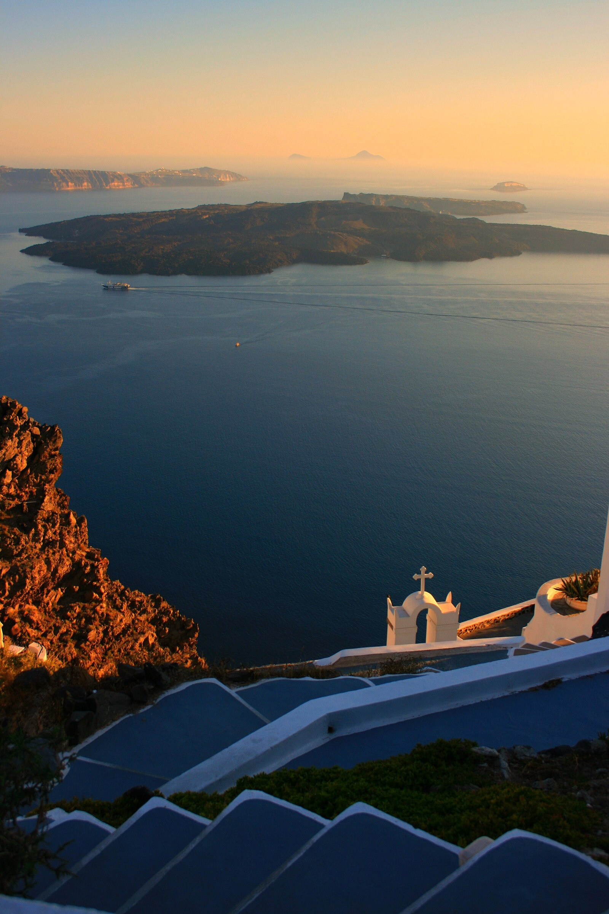
*今も活動を続ける火山島ネア・カメニ*

**見学スポット**
- **ネア・カメニ**: 活火山の火口を間近で見学
- **パレア・カメニ**: 温泉入浴体験
- **ティラシア島**: 静かな漁村の暮らし体験

### セーリングツアー

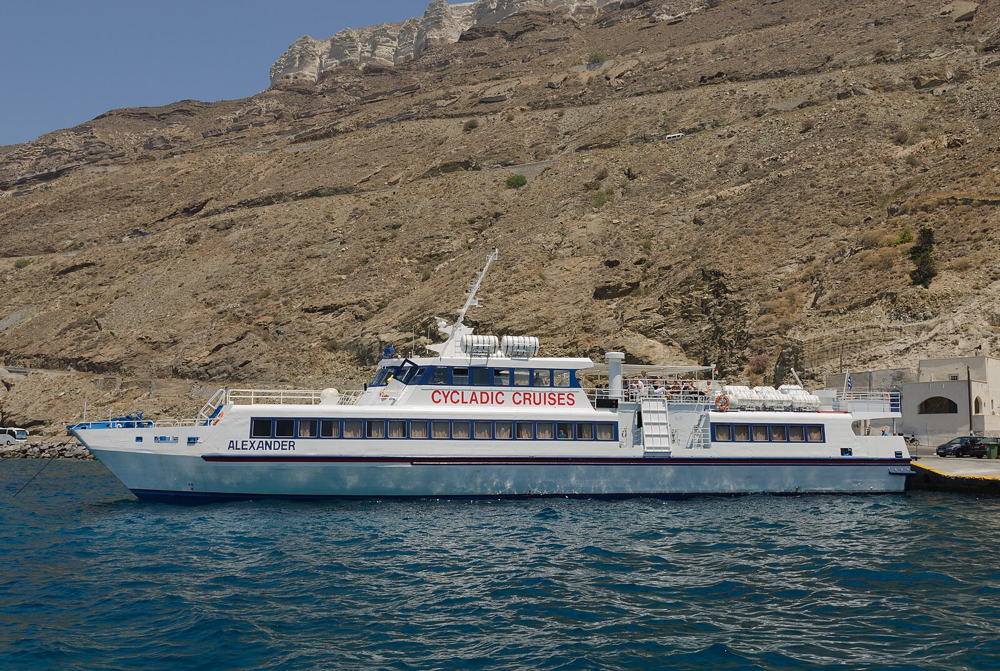
*エーゲ海の美しい海をセーリングで満喫*

**ツアー内容**
- **カルデラクルーズ**: 火山島を海から眺める
- **サンセットクルーズ**: 海上からの絶景夕日
- **シュノーケリング**: 透明度抜群の海で海中探索
- **BBQランチ**: 船上での新鮮な魚介バーベキュー

## 🏨 宿泊とリゾート

### 洞窟ホテル｜ユニークな宿泊体験

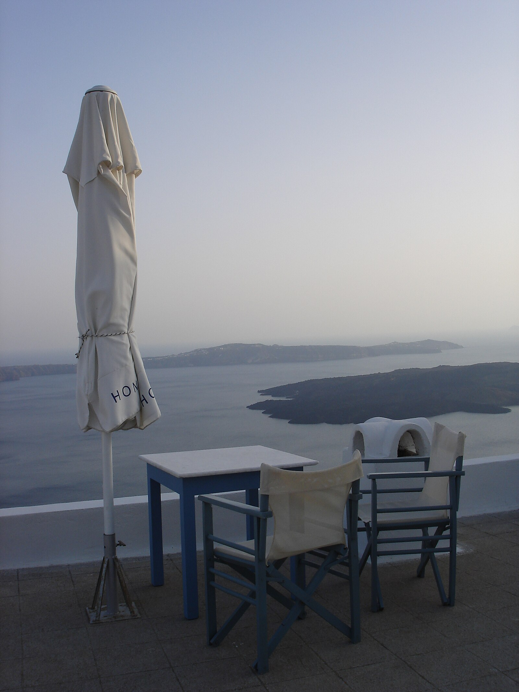
*カルデラビューが楽しめる贅沢な洞窟ホテル*

火山岩を掘って作られた伝統的な洞窟住宅を改装したホテル。

**特徴**
- **自然の断熱効果**: 夏涼しく冬暖かい
- **カルデラビュー**: 絶景を独占できるテラス
- **ロマンチック**: ハネムーンに人気
- **プライベートプール**: 多くの部屋に専用プール

### ラグジュアリーリゾート

**高級ホテル**
- **グレイス・サントリーニ**: 大人専用の超高級リゾート
- **カティキエス**: 世界的に有名なブティックホテル
- **ミスティーク**: セレブに愛される隠れ家リゾート

## 🎪 イベントと文化

### サントリーニ・ミュージック・フェスティバル（9月）

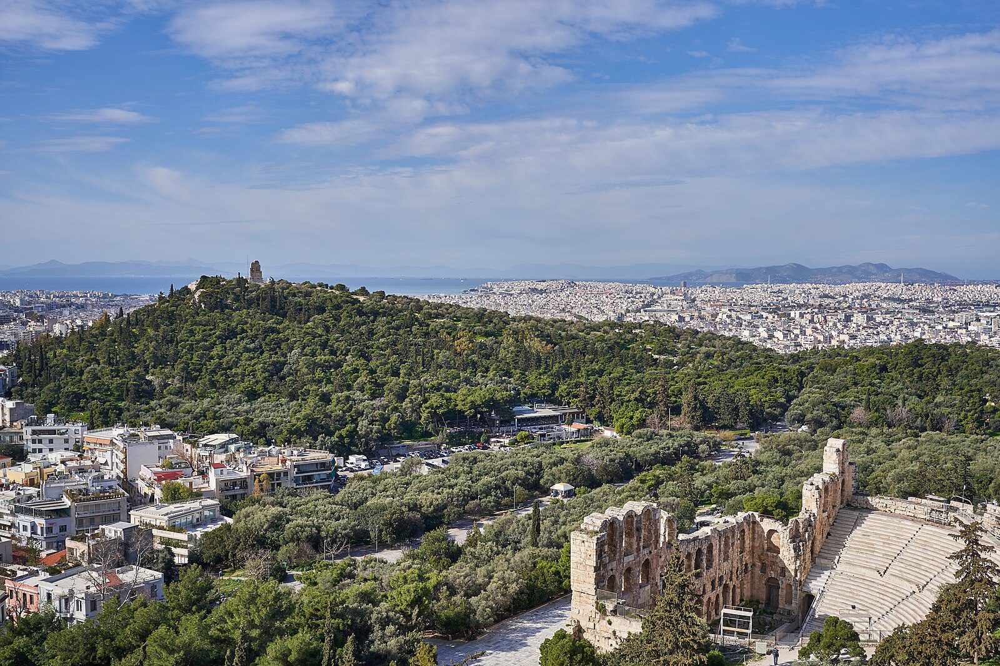
*古代遺跡を背景にしたクラシック音楽コンサート*

古代遺跡や美しい教会を会場にしたクラシック音楽祭。

### 宗教的祭り

**主要な祭り**
- **復活祭**: ギリシャ正教の最重要祭事
- **聖霊降臨祭**: 夏の宗教的祭典
- **聖母昇天祭**: 8月15日の聖母マリア祭

## 💡 サントリーニ島旅行のコツ

### 交通手段
- **フライト**: アテネから約45分
- **フェリー**: アテネのピレウス港から5-8時間
- **島内移動**: レンタカー、バイク、バス、タクシー

### 宿泊予約
- **繁忙期**: 4-10月は数ヶ月前の予約が必要
- **カルデラビュー**: 絶景の部屋は特に人気
- **洞窟ホテル**: ユニークな体験だが予約困難

### 予算目安
- **ホテル**: 1泊15,000-80,000円（季節・立地により大幅変動）
- **食事**: 1食2,000-8,000円
- **アクティビティ**: セーリングツアー8,000-15,000円

### 服装と持ち物
- **日焼け対策**: 強い日差しに備えて帽子・日焼け止め必須
- **歩きやすい靴**: 石畳や階段が多いため
- **羽織もの**: 夕方の海風対策

## 🌸 季節ごとの魅力

### 春（4-6月）
- **気候**: 温暖で過ごしやすい
- **花**: 野花が咲き誇る美しい季節
- **人出**: 比較的観光客が少ない

### 夏（7-8月）
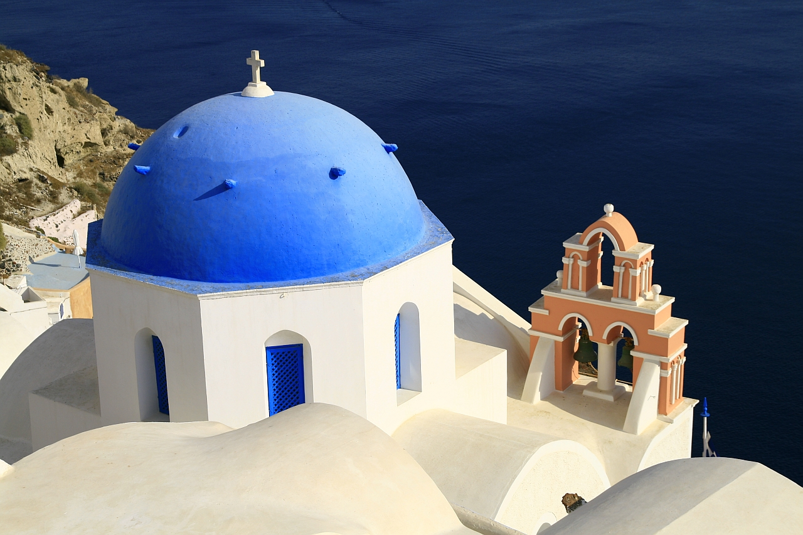
*夏の強い日差しに映える青と白のコントラスト*

- **天気**: 晴天が続き、最も美しい季節
- **ビーチ**: 海水浴に最適
- **混雑**: 最も観光客が多い時期

### 秋（9-11月）
- **気候**: まだ暖かく、泳ぐことも可能
- **ワイン**: ブドウの収穫時期
- **人出**: 夏より落ち着いて観光できる

### 冬（12-3月）
- **気候**: 温暖だが雨季
- **静寂**: 本来の島の姿を体験
- **料金**: ホテルや食事が最も安い

## まとめ

サントリーニ島は、火山活動が生み出した奇跡的な美しさと、3,500年の歴史が織りなす神秘的な魅力に満ちた、地中海の宝石です。青と白のコントラスト、世界一美しい夕日、独特な火山性土壌のワイン、そして温かいギリシャの人々。

*サントリーニ島の魔法のような美しい夕景*

一度この島を訪れると、その美しさと穏やかな時間の流れに魅了され、きっと人生観が変わるような体験ができるでしょう。*Καλώς ήρθατε στη Σαντορίνη!*（サントリーニ島へようこそ！）