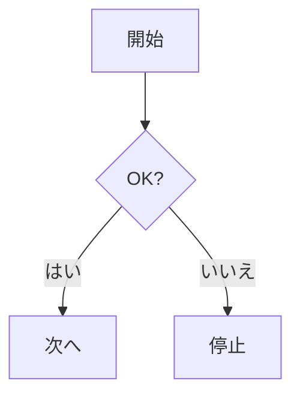

# Markdown サンプル

> このファイルは Markdown の主な書式を網羅したサンプルです。Hugo のプレビューでも、GitHub でも見やすい構成にしています。

---

## 見出し（Headings）

# H1 見出し
## H2 見出し
### H3 見出し
#### H4 見出し
##### H5 見出し
###### H6 見出し

---

## 強調・インライン

- 斜体: *italic* または _italic_
- 太字: **bold** または __bold__
- 打ち消し: ~~strikethrough~~
- 等幅: `inline code`
- 組み合わせ: **太字と `code` の組み合わせ**

---

## 段落・改行

文末に半角スペース2つで  
明示的な改行が入ります。

---

## リスト（Lists）

- 箇条書き 1
  - ネスト 1-1
  - ネスト 1-2
- 箇条書き 2

1. 番号付き 1
2. 番号付き 2
   1. ネスト 2-1
   2. ネスト 2-2

### タスクリスト（Task list）

- [x] 実装済みの項目
- [ ] 未実装の項目
- [ ] 進行中の項目（例: ダークモード最終調整）

---

## リンク（Links）

- インライン: [OpenAI](https://openai.com/)
- 参照式: [Hugo 公式][hugo]
- 自サイト内: [/tags/](./tags/) など

[hugo]: https://gohugo.io/

---

## 画像（Images）

- 基本: 
- 代替テキストは重要（読み上げやSEOのため）

---

## 引用（Blockquote）

> 引用の例です。複数行でも OK。
> 
> - リストも入れられます。
> - ネストも可能。

> Note: これはメモ的な引用です。

---

## コード（Code blocks）

インラインは `const x = 1` のように書けます。

```bash
# Bash の例
set -euo pipefail
hugo version
```

```js
// JavaScript の例
export function add(a, b) {
  return a + b;
}
console.log(add(2, 3));
```

```toml
# Hugo 設定の例
[markup.highlight]
style = "xcode"
noClasses = false
```

---

## Mermaid（ダイアグラム）



---

## テーブル（Tables）

| 機能           | 対応 | 備考                     |
|:---------------|:---:|:-------------------------|
| ダークモード   |  ○  | トグルで切替・記憶       |
| 検索           |  ○  | モーダル + インデックス  |
| シンタックス   |  ○  | Chroma（クラス出力）     |
| Mermaid        |  ○  | ライト/ダーク自動適用     |

---

## 水平線（Horizontal rule）

---

## フットノート（Footnotes）

本文中で脚注を参照します[^1]。複数も可[^note]。

[^1]: これは脚注の例です。
[^note]: こちらは別の脚注。詳細な補足を書けます。

---

## 定義リスト（Definition list）

用語A
: 説明文A。複数行でも良いです。

用語B
: 説明文B。Goldmark の拡張で解釈されます（環境による）。

---

## ちょっとしたヒント（Tips）

> Tip: 画像は `static/`（テーマ内なら `themes/<theme>/static/`）に置くと `/img/...` で参照できます。
>
> 例: 上のサンプルは `/img/default-cover.svg` を使用。

---

お好みに合わせて、このファイルを複製して記事テンプレートとしても使えます。
