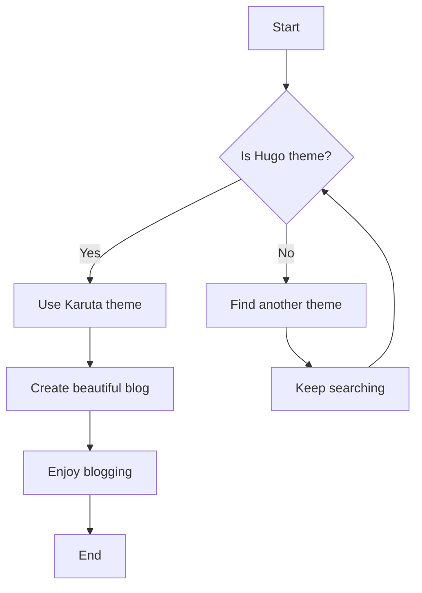
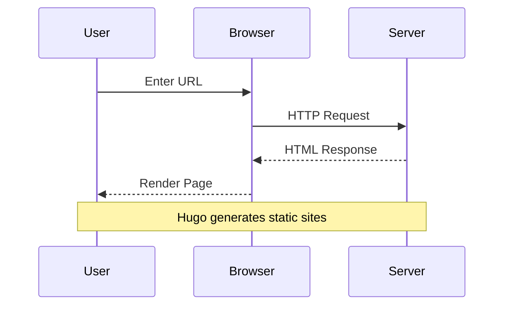
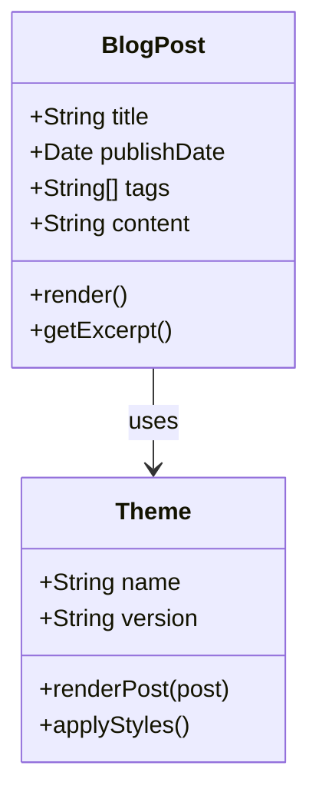

# Mermaid Diagrams

The Karuta theme includes built-in support for Mermaid diagrams, making it easy to create flowcharts, sequence diagrams, and more.

## Flowchart Example



## Sequence Diagram



## Git Flow Diagram

```mermaid
gitgraph
    commit
    branch develop
    checkout develop
    commit
    commit
    checkout main
    commit
    merge develop
    commit
```

## Class Diagram



Mermaid diagrams are rendered beautifully and adapt to the current theme (light/dark mode)!